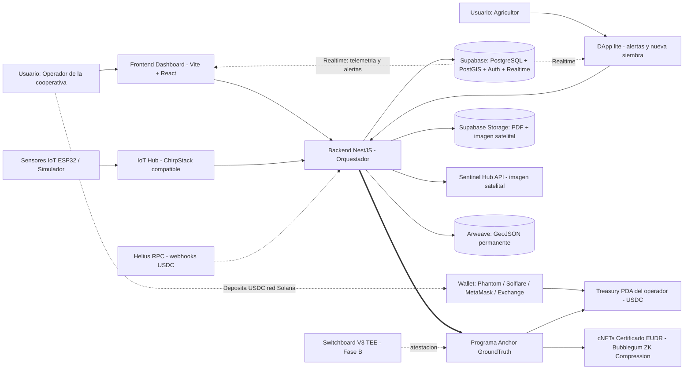

# Anexo 1 — Diagrama simple de arquitectura del MVP

```mermaid
flowchart LR
    user[Usuario: Operador de la cooperativa]
    farmer[Usuario: Agricultor]

    user --> frontend[Frontend Dashboard - Vite + React]
    farmer --> dapp[DApp lite - alertas y nueva siembra]

    user -.->|Deposita USDC red Solana| wallet[Wallet: Phantom / Solflare / MetaMask / Exchange]
    wallet --> treasury[Treasury PDA del operador - USDC]

    frontend --> api[Backend NestJS - Orquestador]
    dapp --> api

    api --> db[(Supabase: PostgreSQL + PostGIS + Auth + Realtime)]
    api --> storage[(Supabase Storage: PDF + imagen satelital)]

    iot[Sensores IoT ESP32 / Simulador] --> hub[IoT Hub - ChirpStack compatible]
    hub --> api

    api --> sat[Sentinel Hub API - imagen satelital]
    api --> arw[(Arweave: GeoJSON permanente)]

    api ==> program[Programa Anchor GroundTruth]
    program --> treasury
    program --> cert[cNFTs Certificado EUDR - Bubblegum ZK Compression]
    helius[Helius RPC - webhooks USDC] -.-> api
    tee[Switchboard V3 TEE - Fase B] -.->|atestacion| program

    db -.->|Realtime: telemetria y alertas| frontend
    db -.->|Realtime| dapp
```
