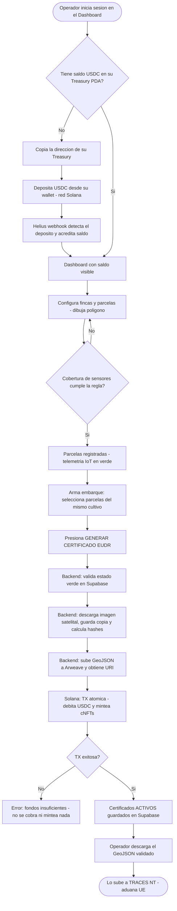

# Anexo 2 — Flujo básico del usuario (Pay-per-Proof)

Mapa: **usuario → wallet → aplicación → Solana → base de datos / API**

```mermaid
flowchart TD
    A([Operador inicia sesion en el Dashboard]) --> B{Tiene saldo USDC en su Treasury PDA?}
    B -->|No| C[Copia la direccion de su Treasury]
    C --> D[Deposita USDC desde su wallet - red Solana]
    D --> E[Helius webhook detecta el deposito y acredita saldo]
    E --> F[Dashboard con saldo visible]
    B -->|Si| F

    F --> G[Configura fincas y parcelas - dibuja poligono]
    G --> H{Cobertura de sensores cumple la regla?}
    H -->|No| G
    H -->|Si| I[Parcelas registradas - telemetria IoT en verde]

    I --> J[Arma embarque: selecciona parcelas del mismo cultivo]
    J --> K[Presiona GENERAR CERTIFICADO EUDR]
    K --> L[Backend: valida estado verde en Supabase]
    L --> M[Backend: descarga imagen satelital, guarda copia y calcula hashes]
    M --> N[Backend: sube GeoJSON a Arweave y obtiene URI]
    N --> O[Solana: TX atomica - debita USDC y mintea cNFTs]
    O --> P{TX exitosa?}
    P -->|No| Q[Error: fondos insuficientes - no se cobra ni mintea nada]
    P -->|Si| R[Certificados ACTIVOS guardados en Supabase]
    R --> S[Operador descarga el GeoJSON validado]
    S --> T([Lo sube a TRACES NT - aduana UE])
```
