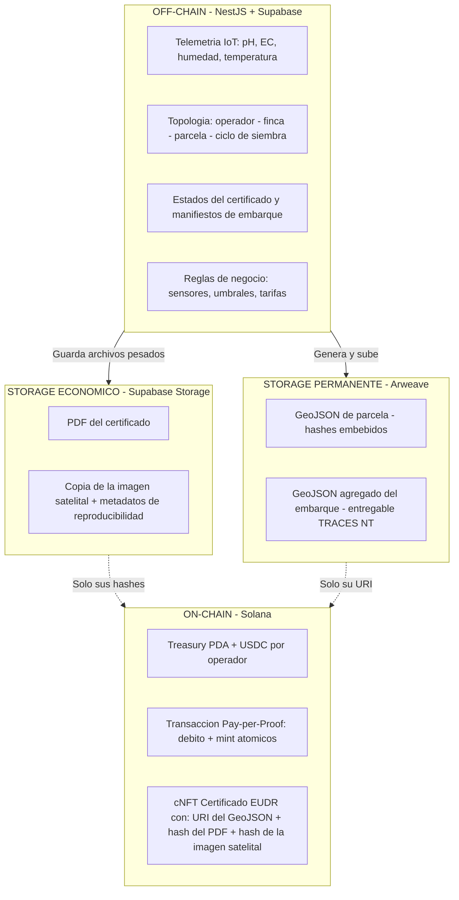

# Anexo 3 — Delimitación on-chain / off-chain

**Principio:** los archivos pesados nunca van on-chain ni a Arweave. On-chain solo viajan el valor (USDC), las referencias (URI) y las huellas criptográficas (hashes SHA-256). El GeoJSON —liviano y jurídicamente vinculante— es lo único que va a storage permanente.
