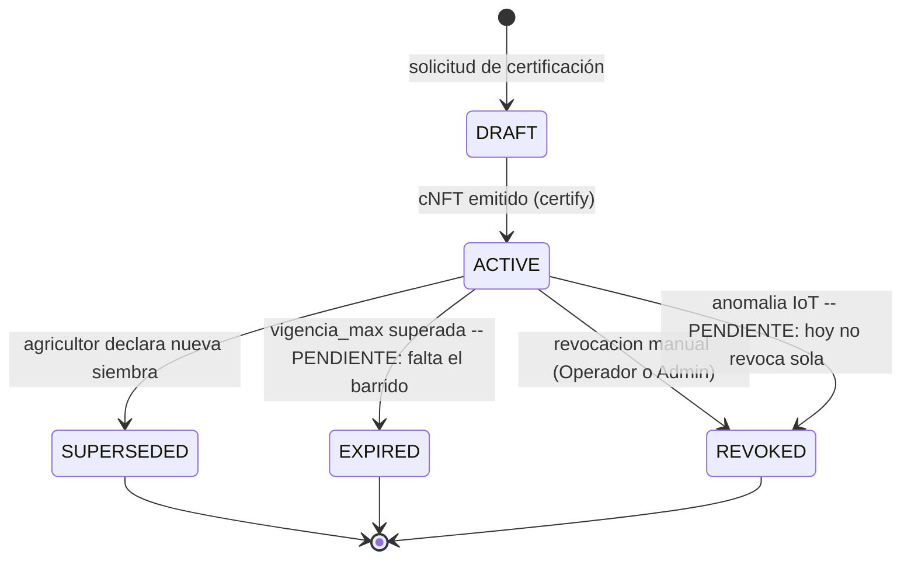
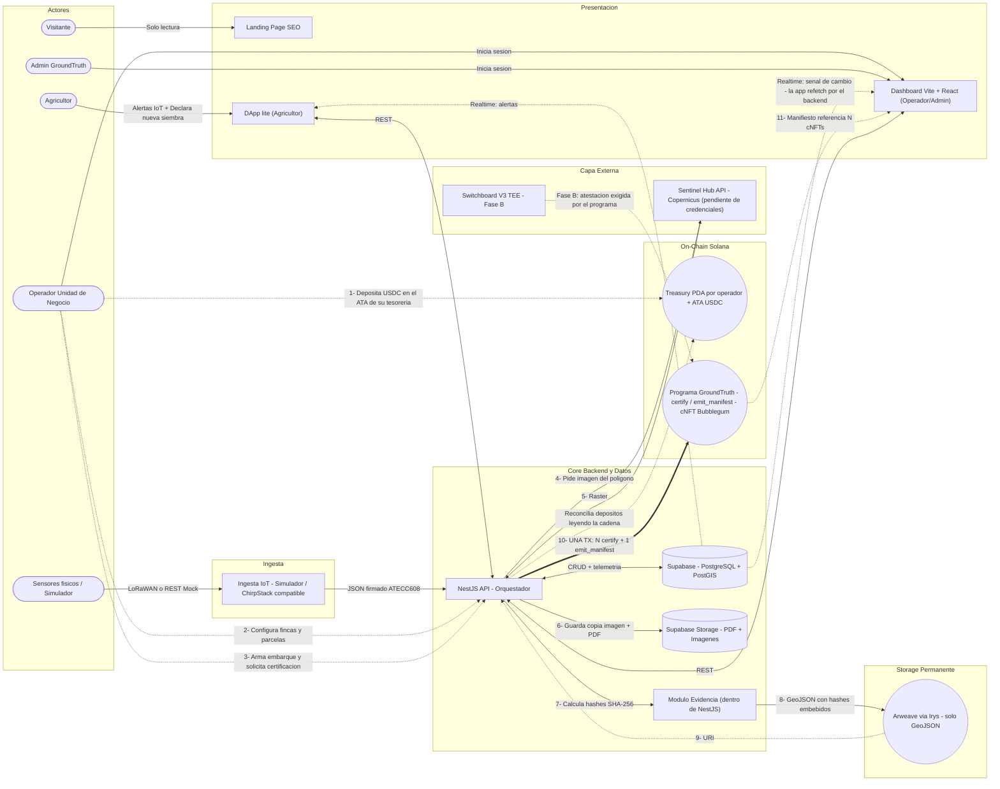
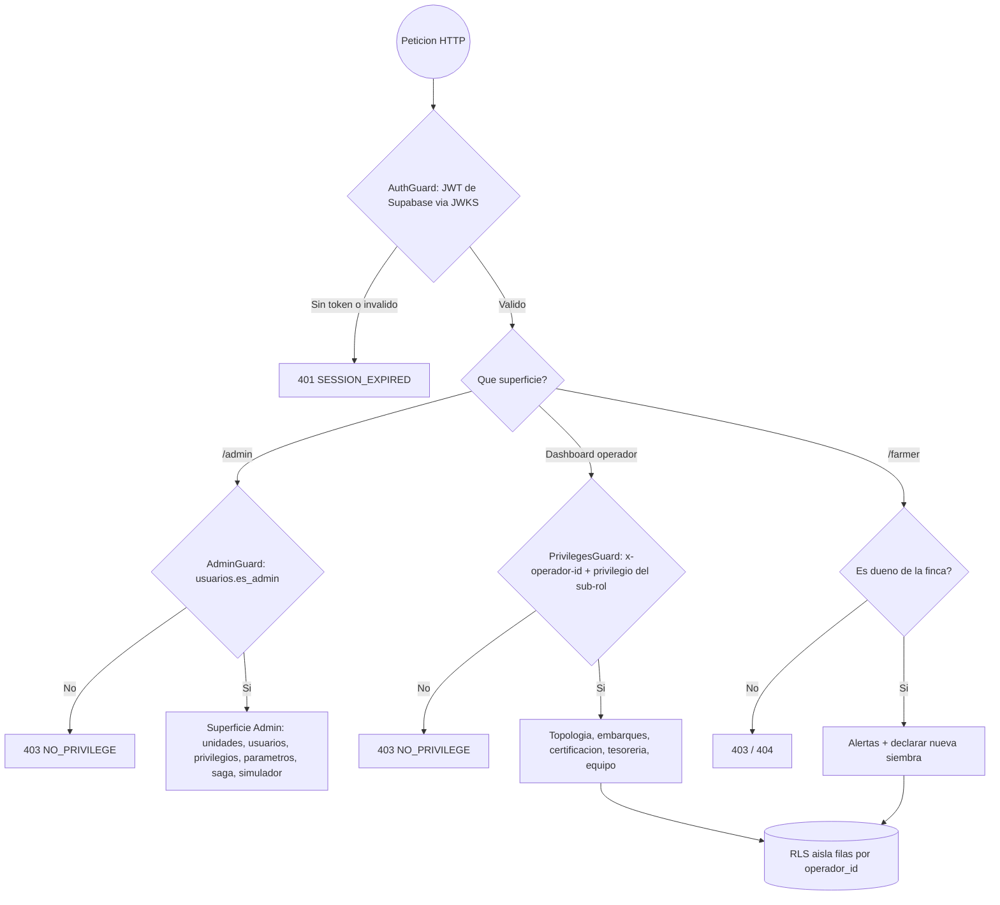
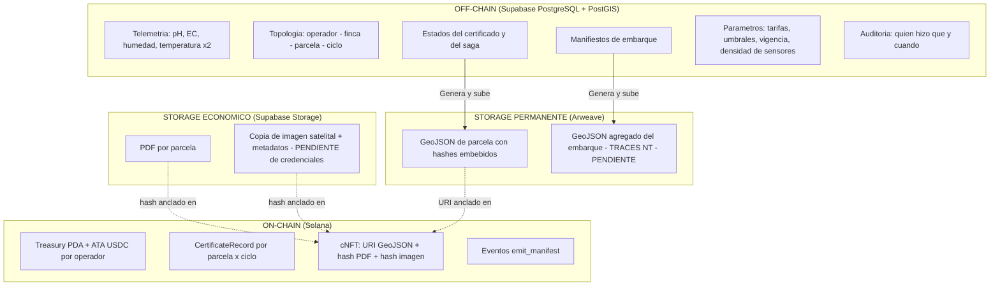
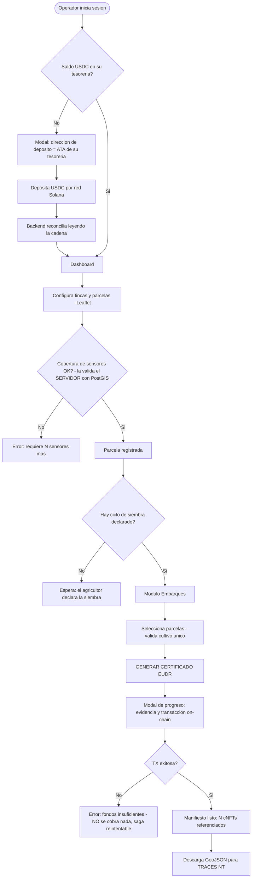
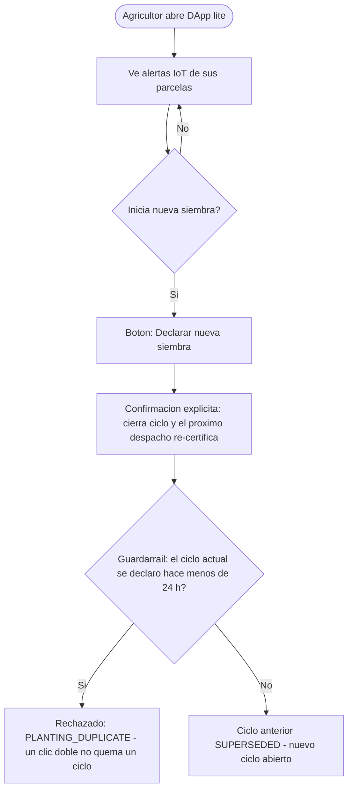

# GroundTruth — Arquitectura Técnica del MVP (v2)

> **Objetivo:** claridad técnica antes del desarrollo fuerte del MVP.
> **Criterio de aceptación:** arquitectura comprensible, viable, alineada al flujo de ingresos (Pay-per-Proof), a la validación comercial (LOIs) y a la inmutabilidad jurídica híbrida (IoT + evidencia satelital).

### Estado de implementación

Este documento se **contrastó contra el código construido** (julio 2026). Cada sección lleva
su marca:

| Marca | Significado |
| --- | --- |
| ✅ | **Construido y verificado.** Funciona contra Postgres y/o contra la cadena. |
| ⚠️ | **Construido, pero con una divergencia o un matiz** respecto a lo que decía este documento. Se explica en el sitio. |
| 🔜 | **Diseño objetivo, no construido.** Sigue en pie: el desarrollo lo contempla. |

Lo que estaba **mal** en la versión anterior de este documento se corrige aquí; no se borra
nada del diseño futuro que siga vigente.

---

## 0. Control del documento

| Documento | Rol | Autoridad |
| --- | --- | --- |
| `Modelo_de_Negocio_GroundTruth.md` | Fuente de verdad de negocio | **Vinculante** |
| `GroundTruth-Arquitectura-Tecnica-MVP.md` (este documento) | Arquitectura Técnica del MVP | Documento de trabajo |
| `Roadmap_del_Producto.md` | Referencia temprana | No vinculante |

Este documento integra las **decisiones D1–D10** (registradas en el Anexo A) y mitiga los **puntos de fallo F1–F7** identificados en el análisis previo.

**Correcciones principales respecto a la versión anterior:**

1. Unidad de certificación: de "por parcela suelta" (y "por lectura" en el prototipo) → **por parcela × ciclo de siembra**, con capa de agregación de embarque (D1).
2. La imagen satelital **ya no se descarta** tras hashear: se retiene en Supabase Storage (D4, resuelve F1).
3. El PDF **ya no va a Arweave**: va a Supabase Storage con su hash anclado on-chain; a Arweave solo va el GeoJSON vinculante (D4-bis).
4. Regla de sensores unificada y configurable (D5, resuelve F2).
5. Treasury PDA **por operador** (D8, resuelve F3). Referencia a MetaMask corregida con matiz (soporta Solana nativo desde 2025).
6. Switchboard V3 TEE reintegrado como diseño objetivo con activación escalonada en Fase B (D3).
7. Rol del agricultor redefinido: DApp lite (alertas + declarar siembra), sin acceso al dashboard (D6).
8. Telemetría ampliada a la firma química completa: pH, EC, humedad, temperatura ×2 profundidades, inercia térmica derivada (D7).
9. Programa Anchor **nuevo y único** (D9); el prototipo en devnet no se extiende.
10. Canal realtime único (Supabase Realtime, F6) y modelo de auth definido (Supabase Auth + RLS, F7).

---

## 1. Filosofía de diseño

El MVP de GroundTruth es una máquina de conversión de cumplimiento regulatorio EUDR en ingresos automatizados, construida sobre una **prueba híbrida de doble capa**:

- **Prueba química (verdad en el terreno):** la telemetría IoT (pH, conductividad eléctrica, humedad, temperatura a dos profundidades e inercia térmica derivada) demuestra que el suelo corresponde a bosque nativo / cultivo sostenible y no a un monocultivo camuflado (anti-greenwashing).
- **Prueba visual geoespacial:** la imagen satelital más reciente de Sentinel Hub, retenida como copia verificable, cuyo hash SHA-256 se ancla al certificado.

### 1.1 Reglas estrictas de la arquitectura

1. **Cualquier capa técnica puede reemplazarse, excepto el flujo de dinero y la inmutabilidad de la prueba.**
2. **Adopción Web3 progresiva:** Fase 1 (depósito manual USDC) → Fase 2 (transacciones patrocinadas, micropago al agricultor) → Fase 3 (Account Abstraction + rampas FIAT).
3. **Modelo de confianza evolutivo:** MVP (el backend firma) → Fase B escalón 1 (validación IoT en TEE) → Fase B escalón 2 (hash satelital en TEE). El programa on-chain nace con el gate de atestación previsto (stub), de modo que cada escalón sea una activación, no una reescritura.
4. **Optimización de costos por peso y rol (tres capas de almacenamiento):** los archivos pesados nunca van on-chain ni a Arweave. Cada artefacto vive donde su rol lo exige:

| Artefacto | Peso | Rol jurídico | Dónde vive | Qué va on-chain |
| --- | --- | --- | --- | --- |
| **GeoJSON** | KB | Entregable vinculante a aduana (TRACES NT) | **Arweave** (permanente) | Su **URI** |
| **PDF** | MB | Documento legible de respaldo | **Supabase Storage** | Su **hash SHA-256** |
| **Imagen satelital** | MB | Evidencia visual | **Supabase Storage** | Su **hash SHA-256** |
| **Telemetría cruda** | — | Dato operativo | **Supabase (PostgreSQL)** | — |

La fuerza jurídica no vive en los archivos: vive en los **hashes anclados on-chain** y en la **permanencia del GeoJSON** en Arweave. El GeoJSON permanente incluye, embebidos, los hashes del PDF y de la imagen (doble anclaje sin costo adicional).

> ✅ **Construido y verificado end-to-end.** El SHA-256 recalculado sobre el PDF descargado de
> Storage coincide con el hash embebido en el GeoJSON de Arweave **y** con el grabado en el
> `CertificateRecord` on-chain.

---

## 2. Modelo de dominio y unidad de certificación (D1) ✅

### 2.1 Jerarquía de entidades

```
Operador (unidad de negocio / cooperativa)
 └── Finca (pertenece a 1 agricultor)
      └── Parcela (1 cultivo; N sensores según área)
           └── Ciclo de siembra (declarado por el agricultor)
                └── Certificado = 1 cNFT por (parcela_id, ciclo_siembra_id)

Embarque = selección transversal N:N de parcelas (de varias fincas, un solo operador)
```

- **Unidad de prueba y de emisión: la parcela.** Cada parcela certificada emite **1 cNFT** con: URI del GeoJSON de parcela (Arweave) + hash del PDF + hash de la imagen satelital + campo de atestación TEE (reservado, Fase B).
- **Identidad del certificado:** el par `(parcela_id, ciclo_siembra_id)` es la llave de idempotencia. Determina si un despacho reutiliza un cNFT vigente o emite uno nuevo.
- **Lote = parcela (1:1) en el MVP.** El lote comercial multi-parcela queda como extensión (ver §15.E).

### 2.2 Embarque (manifiesto)

- Selección N:N de parcelas de varias fincas pertenecientes a **una sola unidad de negocio**. El caso multi-operador queda como extensión.
- **Regla de unicidad de cultivo:** todas las parcelas de un embarque comparten el mismo cultivo (validador backend + bloqueo en UI).
- El manifiesto es un **registro off-chain** (Supabase) + un **GeoJSON agregado** (`FeatureCollection` con los N polígonos; cada `Feature` lleva como propiedades el asset ID del cNFT, el URI de su GeoJSON de parcela y sus hashes) que se sube a **Arweave** como entregable a TRACES NT, más un PDF agregado en Supabase Storage.
- **No se emite un cNFT de embarque**: el manifiesto referencia los N cNFTs de parcela.

> ⚠️ **Matiz.** Hoy `emit_manifest` **cobra la micro-tarifa y emite el evento on-chain con el
> URI del manifiesto**, pero el **GeoJSON agregado del embarque y su PDF todavía no se
> generan**: solo se generan los de parcela. Es lo siguiente que cierra el entregable a
> TRACES NT.

### 2.3 Vigencia del certificado (anclada al ciclo de siembra) ✅

El estado del certificado se gestiona **off-chain (Supabase)** — el cNFT es inmutable y actúa como registro permanente de la emisión; lo que cambia de estado es el registro que gobierna su reutilización.



> Los cinco estados existen en la base (`certificado_estado`) y **`DRAFT → ACTIVE →
> {SUPERSEDED | REVOKED}` funciona hoy**. Las dos transiciones marcadas *PENDIENTE* son diseño
> vigente pero **no implementado**: nadie barre los certificados vencidos (la fecha se graba,
> pero no se actúa sobre ella) y la anomalía IoT levanta la alerta al agricultor **sin revocar
> el certificado**. Siguen en pie (§15.D).

Reglas:

1. Solo un certificado `ACTIVE` puede reutilizarse en un embarque.
2. **Misma siembra → mismo cNFT.** Si la parcela produce para varios embarques, o la cosecha es escalonada, se reutiliza el certificado sin re-certificar ni re-cobrar certificación.
3. **Nueva siembra → cNFT nuevo.** La declara **el agricultor** desde la DApp lite (con confirmación). Cierra el ciclo anterior (`SUPERSEDED`, se conserva como histórico inmutable).
4. **Tope de seguridad `vigencia_max`, configurable por tipo de cultivo** (café, cacao y aguacate tienen ciclos distintos). Superado el tope sin declaración → `EXPIRED`.
   - ✅ La vigencia **se lee de `parametros_cultivo` al emitir** (por defecto 270 días). El Admin la edita y el cambio afecta a la siguiente certificación.
   - 🔜 El paso automático a `EXPIRED` cuando vence el tope **aún no tiene su tarea programada**: hoy la fecha queda grabada, pero nadie la barre.
5. **Revocación (`REVOKED`)** manual desde el dashboard (Operador o Admin). La revocación automática por anomalía de telemetría IoT y la satelital quedan pendientes (§15.D).
6. **Evidencia congelada al emitir:** snapshot de imagen, hashes y GeoJSON de esa fecha. Al reutilizar no se re-descarga satélite.

### 2.4 Cobro (Pay-per-Proof) ✅

| Concepto | Cuándo se cobra | Cuánto |
| --- | --- | --- |
| **Tarifa de certificación** | Por cada **cNFT nuevo** emitido (una vez por ciclo de siembra de cada parcela) | `tarifa_certificacion` (parámetro configurable) |
| **Micro-tarifa de manifiesto** | Por cada **embarque** generado, aunque reutilice el 100% de cNFTs vigentes | `tarifa_manifiesto` (parámetro configurable) |
| **Micropago al agricultor** | — | 🔜 **Fase 2** (D2) |

Al despachar un embarque, el sistema: reutiliza los certificados `ACTIVE`, emite (y cobra) los que falten, y cobra la micro-tarifa de manifiesto. Todo se debita de la **Treasury PDA del operador que despacha** (un embarque nunca cruza operadores → una sola tesorería por transacción).

Las tarifas viven en `parametros_globales` y **el programa las cobra tal como las lee el
backend al certificar**: cambiarlas en el Admin cambia el cobro real.

---

## 3. Mapa general de actores y sistema de ingresos



**Cambios respecto al diagrama anterior:** el "EUDR Reporter" **no es un servicio aparte** —
es el módulo de evidencia dentro de NestJS—; la certificación va en **una sola transacción**
(N `certify` + 1 `emit_manifest`); el operador deposita en el **ATA** de su tesorería (no en
la PDA); y la reconciliación de depósitos **lee la cadena** (el webhook solo avisa).

---

## 4. Autenticación, roles y autorización (F7) ⚠️

**Modelo elegido: Supabase Auth + RLS + autorización por privilegios en NestJS.**

> ⚠️ **Esta sección cambió sustancialmente respecto a la versión anterior**, que describía tres
> roles fijos (`ADMIN` / `OPERATOR` / `FARMER`) como si fueran una columna. **No lo son.**

### 4.1 Los dos principios

1. **RLS aísla FILAS; NestJS autoriza ACCIONES.** Postgres decide *qué filas* ve cada quien
   (multi-tenancy por `operador_id`). *Qué se puede hacer* con ellas lo decide el backend,
   evaluando los privilegios del sub-rol. **Nunca se mezclan**: meter reglas de negocio en RLS
   las volvería invisibles y difíciles de auditar.
2. **"Rol ≠ persona": no existe una columna `rol`.** Los roles se **derivan**:
   - Eres **operador** si tienes una **membresía activa** en una unidad.
   - Eres **agricultor** si eres dueño de al menos una **finca**.
   - Eres **admin de plataforma** si `usuarios.es_admin`.

   Una misma persona puede ser operadora y agricultora a la vez, y `GET /me` devuelve ambas
   superficies. Esto es más fiel a la realidad de una cooperativa que un enum.

### 4.2 Privilegios y sub-roles

Dentro de una unidad, lo que alguien puede hacer lo define su **sub-rol**, que es un conjunto
de **privilegios** de un catálogo de plataforma (`unidad.configurar`, `equipo.gestionar`,
`certificados.emitir`, `certificados.revocar`, `tesoreria.ver`, …). Los sub-roles los crea
cada unidad; el catálogo lo gobierna el Admin.

- **Guardarraíl "nunca sin timón":** una unidad no puede quedarse sin nadie que tenga
  `equipo.gestionar`. Lo impone un **trigger en la base de datos**, no solo la aplicación.
- **Privilegios sensibles** (`certificados.emitir`, `certificados.revocar`) se marcan como
  tales y la UI avisa al concederlos.

| Superficie | Quién entra | Cómo se autoriza |
| --- | --- | --- |
| **Dashboard (Operador)** | Quien tiene membresía activa | `PrivilegesGuard` + cabecera `x-operador-id` → privilegios del sub-rol |
| **Dashboard (Admin)** | `usuarios.es_admin` | `AdminGuard`. **No usa `x-operador-id`**: el admin no pertenece a una unidad, las cruza todas |
| **DApp lite (Agricultor)** | Dueño de una finca | **Por propiedad de la finca**, no por privilegio. Sin `x-operador-id` |



**Un privilegio deprecado** deja de poder **asignarse** a sub-roles nuevos, pero quien ya lo
tiene lo conserva: no se rompe a nadie en caliente.

---

## 5. Telemetría y nodo IoT (D5, D7)

### 5.1 Esquema de telemetría ✅

El payload sustenta la propuesta de valor. Formato JSON compatible con ChirpStack (hardware futuro = zero changes en el backend):

> ✅ **Ingesta implementada (Bloque 2).** El endpoint oficial `POST /telemetria/ingest`
> (`groundtruth-api/src/telemetria/`) recibe este payload, resuelve el nodo, evalúa el semáforo
> contra `umbrales_eudr`, persiste en `lecturas_telemetria` y alerta — todo en
> `TelemetriaIngestionService`. El simulador IoT alimenta **el mismo servicio en proceso**, así
> que hardware real y simulado comparten evaluación/persistencia/alertado: el día que llegue el
> sensor físico solo se apaga el simulador. Auth actual: secreto compartido
> (`TELEMETRIA_INGEST_SECRET`, estilo webhook Helius); el HMAC por-nodo + verificación de la
> firma ATECC608 son follow-up (el campo `firma` ya se persiste en `firma_hex`).

```json
{
  "node_id": "GT-NODO-0001",
  "parcela_id": "uuid",
  "ts": "2026-07-10T09:30:00Z",
  "firma": "<firma ATECC608 del payload>",
  "lecturas": {
    "ph": 5.6,
    "ec_us_cm": 480,
    "humedad_suelo_pct": 41.2,
    "temp_suelo_prof1_c": 21.4,
    "temp_suelo_prof2_c": 19.8
  }
}
```

| Variable | Tipo | Origen |
| --- | --- | --- |
| pH del suelo | Lectura directa | Sonda analógica |
| Conductividad eléctrica (EC) | Lectura directa | Sonda analógica |
| Humedad del suelo | Lectura directa | Capacitivo analógico |
| Temperatura del suelo ×2 profundidades | Lectura directa | 2× sensores digitales 1-Wire (pin compartido) |
| **Inercia térmica** | **Métrica derivada** | Calculada por el backend sobre la serie temporal de temperatura a 2 profundidades (amplitud/desfase). No consume pines ni es un campo del payload |

> ⚠️ La **inercia térmica** todavía **no se calcula**: las dos temperaturas se almacenan, pero
> la métrica derivada no está implementada. Sigue en pie.

### 5.2 Nodo físico v1 — restricciones documentadas 🔜

El MVP opera con **simulador**. Estas restricciones documentan el nodo real sin bloquear nada
ahora:

- Los tres sensores analógicos (pH, EC, humedad) **deben usar el bloque ADC1** del
  microcontrolador (GPIO 32–39): el ADC2 queda inutilizable con la radio (WiFi/LoRa) activa.
- Las 2 sondas de temperatura son digitales 1-Wire y **comparten un solo pin** por direccionamiento.
- **ATECC608** (elemento seguro: firma las lecturas en origen → cadena de custodia criptográfica) y **RTC** (timestamp fiable) van por I²C (2 pines compartidos).
- El ADC del microcontrolador no es lineal de fábrica: pH y EC **exigen calibración y acondicionamiento de señal por nodo**. Esto forma parte del ajuste en campo (§15.B), no del MVP.

### 5.3 Regla de sensores (D5, resuelve F2) ⚠️

> **"Mínimo 1 sensor por cada N m² de parcela; se permiten N sensores por parcela según su área."**

- Se **elimina** la regla "un sensor por parcela" (contradecía a la anterior en parcelas grandes).
- **Validación activa (gate):** el sistema calcula la cobertura requerida por área y **bloquea
  la certificación** si no se cumple, indicando cuántos sensores faltan.
  ✅ **El gate lo impone el SERVIDOR**, con el área calculada por PostGIS — no el navegador. Es
  una regla de negocio: no puede vivir en el cliente. (En la práctica los números difieren: el
  estimador del mapa dio 9 ha donde PostGIS dice 10,75.)
- ⚠️ **El umbral por defecto es 20.000 m² (2 ha por sensor), no 5.000 m² como decía este
  documento.** Es un **parámetro configurable** (`densidad_sensores_m2_default`, editable por
  el Admin), y sigue siendo **provisional**: la hipótesis a validar en campo puede variar por
  cultivo y topografía (§15.B).
- En el simulador, "asignar N sensores" = instanciar N nodos simulados; el validador cuenta nodos vs área igual que con hardware real.

### 5.4 Simulador ✅

Perfiles diferenciados que demuestran el contraste de la propuesta de valor:

- **"Suelo sano / bosque nativo"** → valores correlacionados en rango verde.
- **"Suelo degradado / monocultivo"** → firma química fuera de umbral → estado rojo → **alerta
  al agricultor** y parcela bloqueada para embarque.

Los valores **se derivan de los umbrales reales de la base**: si el Admin cambia los umbrales,
el simulador cambia con ellos.

### 5.5 Umbrales EUDR ✅

Los rangos verde/rojo por variable y por cultivo son **parámetros configurables y provisionales** (criterio agronómico/regulatorio a calibrar en terreno), gestionados por el Admin. La evaluación de umbrales ocurre **off-chain** (backend en el MVP; TEE en Fase B) — nunca on-chain, porque los umbrales son configurables y la telemetría vive en Supabase.

---

## 6. Evidencia satelital (D4, resuelve F1) ⚠️

**Problema resuelto:** la Process API de Sentinel Hub renderiza al vuelo (evalscript, bandas, bbox, CRS, resolución, formato) y Copernicus reprocesa productos. Dos descargas "de la misma imagen" → bytes distintos → hash distinto. La versión anterior descartaba la imagen tras hashear, dejando el certificado indefendible ante un auditor.

**Mecanismo (retener copia + metadatos):**

1. Al certificar, se descarga la imagen recortada al polígono de la parcela y se **almacena en Supabase Storage**.
2. El **SHA-256 se calcula sobre esa copia almacenada**; ese hash se ancla al cNFT.
3. La verificación del auditor es **contra la copia retenida** → el hash siempre coincide.
4. Junto a la copia se guardan los **metadatos de reproducibilidad**: producto/tile ID de Copernicus, timestamp de adquisición, **evalscript versionado**, bbox, CRS, resolución, formato.

> ⚠️ **El pipeline está construido pero APAGADO: faltan las credenciales de Sentinel Hub**
> (`SENTINEL_CLIENT_ID` / `SENTINEL_CLIENT_SECRET`). Mientras no existan, el certificado se
> emite **sin imagen y con su hash en ceros** — **no se inventa un hash**. En cuanto se
> configuren, se enciende sin tocar código.

**Fase B (escalón 2) 🔜:** la descarga y el guardado ocurren dentro del TEE; la atestación prueba que la copia proviene de una respuesta auténtica de Sentinel Hub, cerrando la objeción "¿y si el operador manipuló su copia?".

---

## 7. Capa on-chain: programa Anchor nuevo y único (D8, D9) ✅

### 7.1 Por qué programa nuevo

El prototipo en devnet (`initialize_farm`, `register_node`, `certify_reading`) certificaba **por lectura** y evaluaba solo temperatura y humedad; no manejaba tesorería USDC, cobro, cNFTs ni atestación. Se **reutilizan los conceptos** de PDAs determinísticas e identidad (`Farm`, `Parcel`); el núcleo se partió limpio.

### 7.2 Cuentas (PDAs) ✅

| Cuenta | Seeds | Rol |
| --- | --- | --- |
| `Config` | `["config"]` | Admin, firmante del backend, mint de USDC, **techos de cobro**, gate de atestación |
| `Operator` | `["operator", operador_id]` | Identidad de la unidad de negocio |
| `Treasury` | `["treasury", operador_id]` | *Authority* de la tesorería. Los USDC viven en su **ATA**; solo el programa autoriza débitos vía signer seeds |
| `Farm` | `["farm", finca_id]` | Gemelo digital de la finca |
| `Parcel` | `["parcel", parcela_id]` | Identidad de la parcela |
| `CertificateRecord` | `["cert", parcela_id, ciclo_id]` | **Idempotencia on-chain**: impide doble emisión para el mismo (parcela, ciclo). Guarda el asset ID del cNFT, el URI del GeoJSON y los hashes |

Los `*_id` son los **UUID de Postgres tal cual** (16 bytes crudos): cada PDA es derivable
desde la base de datos sin guardar ningún mapeo — y por tanto sin poder desincronizarse.

### 7.3 Instrucciones ✅

| Instrucción | Qué hace | Débito |
| --- | --- | --- |
| `init_config` / `update_config` | Config global: firmante del backend, mint de USDC, techos de cobro, gate TEE. `update_config` permite la **rotación de llaves** (F5) | — |
| `init_operator_treasury` | Crea Operator + Treasury PDA + ATA | — |
| `set_operator_active` | Suspende/reactiva una unidad on-chain | — |
| `create_certificate_tree` | Crea el árbol Merkle de los cNFTs. El *tree creator* es la **PDA `Config`** y el árbol es privado: **solo `certify` puede acuñar en él** | — |
| `register_farm` / `register_parcel` | Registra identidades | — |
| `certify` | **Por parcela.** (1) Verifica autorización (firma del backend; **atestación en Fase B — gate presente**); (2) crea `CertificateRecord` (falla si ya existe → idempotencia); (3) debita la tarifa de la Treasury; (4) **mintea el cNFT vía CPI a Bubblegum** con: URI del GeoJSON (Arweave) + hash del PDF + hash de la imagen | `tarifa_certificacion` |
| `emit_manifest` | Debita la micro-tarifa de manifiesto y emite el evento con el URI del manifiesto. Se ejecuta en **cada** despacho, incluso si reutiliza el 100% de cNFTs | `tarifa_manifiesto` |

> ⚠️ **Corrección importante respecto a la versión anterior de este documento.** Decía que
> `certify` minteaba "N cNFTs" en una sola instrucción. **No es así, y es mejor que no lo sea:**
> un despacho de N parcelas se envía como **UNA transacción de Solana con N instrucciones
> `certify` + 1 `emit_manifest`**. La atomicidad ya la da la transacción —si cualquiera falla,
> revierten todas—, así que meter N certificados dentro de una instrucción sería más frágil sin
> ganar nada. **Verificado:** una TX con un `certify` duplicado revierte entera, sin cobrar ni
> la certificación ni el manifiesto.

**Techos de cobro on-chain (`max_cert_fee`, `max_manifest_fee`)** — añadido no previsto en la
versión anterior. Las tarifas son un parámetro *off-chain* que viaja firmado por el backend;
sin un techo, **una keypair de backend comprometida (F5) podría vaciar una tesorería en una
sola llamada**. El techo acota el daño por transacción sin quitarle configurabilidad a la
tarifa.

**Reservas de diseño:**
- 🔜 **Gate de atestación Switchboard (Fase B):** presente como interruptor
  (`attestation_required`, hoy `false`). Es una activación, no una reescritura.
- 🔜 **Micropago al agricultor (Fase 2):** **el transfer hook todavía NO existe en el
  programa.** La versión anterior de este documento decía que estaba "reservado en `certify`";
  no lo está. Requiere una PDA por finca, que nace con el registro en terreno (§15.C).

**División on-chain / off-chain de la validación:** la evaluación de umbrales EUDR es **off-chain**. El programa exige **autorización** (firma / atestación), no re-evalúa umbrales: son configurables y la telemetría vive en Supabase.

### 7.4 Fondeo de la tesorería (F3 resuelto) ⚠️

- La tesorería de cada operador es **única y determinística**, así que la atribución de un
  depósito la da la **cuenta destino, sin memo**.
- **La dirección de depósito es el ATA, no la Treasury PDA.** ⚠️ La versión anterior decía
  "la dirección de la Treasury": ahí es donde vive la *authority*, pero **los USDC viven en su
  ATA**, y la PDA está fuera de la curva —varias wallets se niegan a enviarle tokens—. Publicar
  la PDA como destino sería invitar a que un depósito se pierda.
- Aislamiento total: ningún operador puede gastar el USDC de otro (**verificado on-chain**).
- El operador deposita desde cualquier wallet o exchange que opere en **red Solana**: Phantom, Solflare, **MetaMask** (con soporte nativo de Solana desde su actualización multichain de 2025) o exchange con retiro USDC-SPL por red Solana.
- **La cadena es la fuente de verdad, no el webhook.** El webhook de Helius solo *avisa*; la
  ingesta la hace un **reconciliador que lee la cadena**. Un webhook es best-effort: si se
  pierde, el sistema cuadra igual. `saldo_cache` es un espejo y **nunca se calcula sumando
  movimientos**: se toma el saldo real del ATA.
- ⚠️ **Red actual: validador local.** El despliegue a **devnet** está pendiente (el faucet
  público está limitado; hacen falta ~5,5 SOL). Mainnet queda para producción, y **no es un
  switch**: hay que redesplegar el programa y recrear config, árbol, ATA de ingresos y
  tesorerías, además de cambiar el mint de USDC. Solo la Treasury PDA conserva su dirección.

### 7.5 Firmante custodial (F5) ⚠️ **RIESGO VIVO**

Riesgo: la keypair del backend que firma los mints es un punto único de compromiso.

> ⚠️ **Hoy esa keypair está en un fichero `.env` en texto plano.** Quien lea ese fichero —un
> desarrollador, una copia de seguridad, un servidor comprometido— **puede emitir certificados
> GroundTruth falsos**. La mitigación **no está implementada**.

Mitigación prevista: custodia en **KMS/HSM** (nunca en disco/env plano), **rotación periódica**
(ya soportada por `update_config`), y principio de mínimo privilegio (la keypair solo firma
`certify`/`emit_manifest`).

*Nota práctica:* los KMS en la nube cubren bien `secp256k1` (Ethereum), pero Solana usa
`ed25519` — hay que verificar el soporte antes de comprometerse con un proveedor.

El riesgo **se reduce estructuralmente en Fase B**: cuando el programa exija atestación TEE, una keypair comprometida ya no basta para emitir un certificado válido.

Mitigación parcial ya implementada: los **techos de cobro on-chain** (§7.3) acotan cuánto puede
sacar una llamada.

---

## 8. Switchboard V3 TEE (D3): modelo de confianza evolutivo 🔜

**Diseño objetivo (opción fuerte):** Switchboard Functions ejecuta código dentro de un enclave (TEE) cuya huella (MRENCLAVE) queda registrada; el enclave emite una **atestación** verificable on-chain de que la salida provino exactamente de ese código. El programa Anchor exige la atestación antes de mintear. Dos funciones:

1. **Validación IoT:** las lecturas (pH, EC, humedad, temperatura) se evalúan contra los umbrales EUDR dentro del enclave. El backend deja de ser el validador de la prueba química.
2. **Hash satelital verificable:** la descarga de Sentinel Hub y el cálculo del SHA-256 ocurren dentro de la Function, con las credenciales OAuth2 custodiadas por el mecanismo de *Secrets* del TEE. El hash pasa de "afirmación del backend" a prueba verificable.

**Implementación escalonada (Fase B):**

| Escalón | Quién valida | Qué exige el programa | Estado |
| --- | --- | --- | --- |
| **MVP** | Backend NestJS (firma) | Firma del backend | ✅ construido; el gate existe (`attestation_required = false`) |
| **Escalón 1** | TEE valida IoT | Atestación para la prueba química | 🔜 |
| **Escalón 2** | TEE valida IoT + produce hash satelital | Atestación para ambas evidencias | 🔜 |

**Justificación del faseo:** dockerizar la lógica, generar MRENCLAVE, desplegar la Function y verificar atestación añaden complejidad, latencia y costo por ejecución que compiten con tener el flujo end-to-end listo para la validación comercial (LOIs). Cada escalón reduce además el riesgo del firmante custodial (F5).

---

## 9. Flujo de certificación end-to-end (saga, F4) ✅

### 9.1 Orden del flujo y patrón saga

La base de datos y la cadena **no pueden compartir transacción**. Por eso la certificación es
una **saga de tres fases**, y no se finge lo contrario:

1. **Preparar** (transacción en la BD): valida (unicidad de cultivo, cobertura de sensores,
   estado verde, certificados `ACTIVE` reutilizables vs. faltantes) y **reserva el número
   público** — que es el nombre del cNFT, así que hace falta *antes* de mintear. Marca el
   embarque `PROCESANDO` y el saga `CERT_PENDING`.
2. **Evidencia y emisión** (fuera de transacción):
   - Para cada parcela sin certificado vigente: imagen → copia + PDF a **Supabase Storage** →
     hashes → GeoJSON de parcela (con los hashes embebidos) → **Arweave** → URI.
   - **UNA transacción de Solana:** N × `certify` + 1 × `emit_manifest`.
3. **Reconciliar** (transacción en la BD): guarda los `asset_id` de los cNFTs, la firma real de
   la transacción y **el saldo leído de la cadena** — no una resta optimista. El ATA es la
   fuente de verdad; `saldo_cache` es solo un espejo, y así no puede derivar.

**Si la fase 2 falla, la 3 no ocurre y no se cobra nada:** el embarque vuelve a `BORRADOR` y el
saga queda `FAILED` reintentable (el Admin lo reintenta desde su vista). **El reintento
reconcilia en vez de duplicar**: los certificados que ya existen on-chain se detectan por su
PDA `["cert", parcela, ciclo]` y su asset ID se lee de la cadena.

Estados del saga: `CERT_PENDING → ONCHAIN_CONFIRMED` (o `FAILED` con reintento idempotente).

> ⚠️ El estado intermedio `EVIDENCE_READY` existe en el esquema pero **no se usa**: hoy la
> evidencia y la emisión ocurren dentro de la misma fase.

**Propiedades del saga:** si la TX on-chain falla tras subir a Arweave, lo único permanente ya pagado es un GeoJSON de kilobytes (costo despreciable — beneficio directo de sacar el PDF de Arweave). El costo Arweave/Irys queda acotado a kilobytes por certificado.

### 9.2 Diagrama de secuencia

```mermaid
sequenceDiagram
    participant Ag as Agricultor (DApp lite)
    participant Op as Operador
    participant App as Frontend
    participant API as NestJS
    participant TEE as Switchboard TEE (Fase B)
    participant Sat as Sentinel Hub
    participant ST as Supabase Storage
    participant Arw as Arweave
    participant Sol as Solana
    participant DB as Supabase

    Note over Op,Sol: Fase 1 - Fondeo
    Op->>Sol: Deposita USDC en el ATA de su tesoreria
    API->>Sol: Reconcilia leyendo la cadena (el webhook Helius solo avisa)

    Note over Ag,DB: Operacion diaria
    DB-->>Ag: Alertas IoT (Realtime: avisa; el dato lo sirve el backend)
    Ag->>API: Declara nueva siembra (cierra ciclo anterior)

    Note over Op,Sol: Pay-per-Proof
    Op->>App: Arma embarque (N parcelas, mismo cultivo)
    App->>API: POST /embarques/:id/certificar
    API->>DB: FASE 1 - Valida y reserva numero publico (PROCESANDO)
    API->>Sat: Imagen del poligono (solo parcelas sin cert vigente)
    Sat-->>API: Raster
    API->>ST: Guarda copia imagen + PDF
    API->>API: SHA-256 de la copia almacenada
    Note over API,TEE: Fase B: validacion IoT y hash ocurren en el TEE con atestacion
    API->>Arw: GeoJSON de parcela con los hashes embebidos
    Arw-->>API: URI ar://
    API->>Sol: FASE 2 - UNA TX: N x certify + 1 x emit_manifest
    Sol-->>API: Firma confirmada (o revierte TODO)
    API->>DB: FASE 3 - asset_id, firma real y saldo LEIDO de la cadena
    Op->>Arw: Descarga el GeoJSON
    Op->>Op: Sube a TRACES NT
```

---

## 10. Canal realtime único (F6) 🔜

Se elimina el doble canal (Supabase Realtime + WebSockets NestJS). Queda:

- **Supabase Realtime** → telemetría y estados verde/rojo hacia el dashboard, y alertas IoT hacia la DApp lite del agricultor.
- **REST (NestJS)** → comandos y mutaciones (topología, embarques, certificación, declarar siembra).

NestJS **no expone WebSockets** ✅.

> ✅ **El Realtime está implementado** (migraciones 0010 y 0011), con una regla de uso
> deliberada: **es una campana, no un cartero**. El cliente se suscribe, **ignora el
> contenido del evento** y lo único que hace con él es invalidar su caché para volver a
> pedir el dato **por el backend**. Así el navegador nunca lee negocio de Postgres y se
> respeta la regla de §5. La privacidad la impone RLS, que Realtime evalúa por suscriptor.
>
> ⚠️ **Hallazgo, verificado contra la base real:** Supabase Realtime **NO entrega cambios
> de tablas particionadas** — ni por la raíz, ni por el nombre de la partición, ni con
> comodín de esquema, ni poniendo `publish_via_partition_root = true`. Por eso
> `lecturas_telemetria` **no se publica**. El semáforo verde/rojo se materializa en
> `parcelas` (tabla normal) con un disparador que **solo escribe cuando el estado cambia**:
> se escucha eso. Efecto lateral: desaparecieron las 5 subconsultas correlacionadas que
> cada servicio ejecutaba por parcela contra la tabla particionada.
>
> Texto anterior: la UI se actualizaba
> por *refetch* (TanStack Query). Funciona, pero no es lo diseñado: sigue en pie.

---

## 11. Delimitación estricta de almacenamiento ✅



**Vocabulario inequívoco:** "on-chain" = Solana (solo referencias y valor). Arweave es una red de almacenamiento permanente **independiente de Solana** (el puente lo hace el backend; el pago se hace en SOL vía Irys, pero el archivo vive en Arweave). Supabase Storage es storage convencional económico. Nada pesado toca Solana ni Arweave, con la única excepción del GeoJSON liviano.

> ⚠️ **Arweave está en devnet (Irys): efímero, los datos caducan a los ~60 días.** Pasar a
> mainnet publica la **geolocalización de las fincas de forma permanente e irreversible** — es
> una decisión explícita de negocio, no un cambio de configuración descuidado.

---

## 12. Flujos de frontend ✅

### 12.1 Operador (dashboard)



### 12.2 Agricultor (DApp lite)



> **Autorización por propiedad, no por privilegio.** El agricultor no lleva `x-operador-id`: el
> backend comprueba que la parcela pertenece a **una finca suya**. Y declarar siembra tiene
> efecto de cobro futuro (obliga a re-certificar en el próximo despacho), por eso el guardarraíl
> de las 24 h: un doble clic no puede quemar un ciclo.
>
> Las alertas se cargan por **refetch**, no por Realtime (§10).

---

## 13. Dependencias e integraciones críticas

| Dependencia | Uso | Estado |
| --- | --- | --- |
| **Supabase** | PostgreSQL + PostGIS (topología/telemetría), **Storage** (PDF + imágenes), **Auth + RLS** | ✅ |
| **Anchor** | Programa único GroundTruth | ✅ |
| **mpl-bubblegum (Metaplex)** | Minteo de cNFTs con ZK Compression **vía CPI desde el programa** (no vía Umi) | ✅ |
| **Arweave vía Irys** | Solo GeoJSON; pago en SOL | ✅ (devnet, efímero) |
| **Helius RPC** | Webhooks de depósito USDC. **Solo avisa**: la ingesta la hace el reconciliador que lee la cadena | ✅ |
| **Sentinel Hub API** (Copernicus) | Imagen raster del polígono; OAuth2 | ⚠️ construido, **sin credenciales** |
| **Supabase Realtime** | Alertas, semáforo de parcelas y saldo en vivo | ✅ implementado (0010/0011). ⚠️ No sobre tablas particionadas: ver §10 |
| **ChirpStack** | Ingesta IoT real (payload compatible) | ✅ endpoint `POST /telemetria/ingest` (Bloque 2); auth por secreto compartido, HMAC/ATECC608 follow-up. El simulador alimenta el mismo servicio en proceso |
| **Switchboard V3** | Functions TEE + Attestation Program | 🔜 Fase B |

---

## 14. Riesgos técnicos y mitigaciones

| # | Riesgo | Estado |
| --- | --- | --- |
| F1 | Reproducibilidad del hash satelital | ✅ **Resuelto (D4/§6):** copia retenida en Storage + hash de esa copia + metadatos. *(Pendiente de credenciales para activarse.)* |
| F2 | Regla de sensores autocontradictoria | ✅ **Resuelto (D5/§5.3):** formulación única por área, configurable, **gate impuesto por el servidor** |
| F3 | Atribución de depósitos USDC | ✅ **Resuelto (D8/§7.4):** tesorería determinista por operador; atribución por cuenta destino sin memo; **reconciliación contra la cadena** |
| F4 | Falla parcial Arweave ↔ Solana | ✅ **Mitigado (§9.1):** saga de 3 fases, reintento idempotente (`CertificateRecord` on-chain), sin doble cobro. **Verificado:** la TX revierte entera |
| F5 | Firmante custodial | ⚠️ **RIESGO VIVO (§7.5):** la keypair está en un `.env` en texto plano. KMS/HSM **pendiente**. Mitigación parcial: techos de cobro on-chain |
| F6 | Doble canal realtime | ✅ NestJS no expone WebSockets. ✅ El Realtime de Supabase estáá implementado |
| F7 | Auth sin definir | ✅ **Resuelto (§4):** Supabase Auth + RLS (filas) + privilegios en NestJS (acciones). Roles **derivados**, no una columna |
| R8 | Nubosidad andina vs imagen satelital | La imagen es la más reciente disponible, nublada o no: es un "timestamp visual complementario". La prueba primaria es la química (IoT). La certificación no se cae por nubosidad |
| R9 | Latencia de descarga satelital | ✅ Todo el pipeline de evidencia es asíncrono y **previo** a la TX on-chain |
| R10 | Costos on-chain | ✅ cNFTs con ZK Compression; archivos pesados fuera de Arweave/Solana |
| R11 | Precisión analógica del nodo v1 | 🔜 El ADC no es lineal: calibración y acondicionamiento por nodo como requisito del despliegue en campo (§15.B); no bloquea el MVP (simulador) |
| **R12** | **Invitación y login de usuarios creados** | ⚠️ **NUEVO.** Los usuarios que crea el Admin (y los agricultores) nacen con un `auth_user_id` de relleno: **existen en el dominio pero no pueden iniciar sesión**. Falta el flujo de invitación de Supabase Auth |

---

## 15. Fuera de alcance del MVP / Puntos de extensión (D10) 🔜

Delimita qué NO se construye ahora y **dónde se enchufa** cada extensión, para que ninguna sea una reescritura.

**A. Líneas de negocio futuras**
- **Asistente Agronómico IA:** consume la misma telemetría de Supabase que alimenta las alertas IoT. Enchufe: capa de lectura sobre telemetría existente.
- **Data Marketplace & Seguros (DeSci):** consume los datasets certificados que el MVP ya produce.

**B. Despliegue físico y capa IoT real**
- **Registro en terreno:** técnico clava sensor, GPS del perímetro, QR → gemelo digital (PDA de finca). En el MVP lo sustituye el polígono en Leaflet dibujado por el operador. Enchufe: reemplaza la carga manual de topología.
- **Ajuste y calibración de sensores en campo:** validación de hardware, calibración de pH/EC por nodo, y **recalibración de la densidad de sensores** (hoy 2 ha por sensor, provisional).

**C. Incentivos y pagos al agricultor**
- **Micropago ("fracción de centavo"):** requiere wallet/PDA por finca (nace en el registro en terreno) **y el transfer hook, que aún no existe en el programa**. Enchufe: nueva instrucción o hook dentro de `certify`.

**D. Monitoreo satelital en tiempo real**
- Monitoreo continuo por parcela (hoy el satélite es soporte puntual de evidencia).
- **Alertas climáticas de detección temprana** (heladas, precipitaciones) al agricultor.
- **Revocación automática** por anomalía IoT o por cambio detectado vía satélite. Enchufe: la máquina de estados ya contempla `REVOKED`; hoy la revocación es manual.

**E. Agregación y multi-operador**
- **GeoJSON y PDF agregados del embarque** (el entregable a TRACES NT); hoy solo se generan los de parcela.
- **Barrido de vigencia** que pase a `EXPIRED` los certificados vencidos.
- **cNFT de embarque agregado** (hoy el embarque es manifiesto lógico).
- **Embarque multi-operador** (exportador que agrega varias cooperativas → débito multi-tesorería).
- **Lote comercial multi-parcela** (hoy lote = parcela 1:1).

**F. Adopción Web3 progresiva y canales**
- **Account Abstraction + rampas FIAT** (Fase 3). El MVP opera en Fase 1: depósito manual USDC.
- **WhatsApp como canal adicional** de las mismas alertas IoT.

---

## Anexo A — Registro de decisiones (D1–D10)

| # | Decisión | Resumen | Estado |
| --- | --- | --- | --- |
| D1 | Unidad de certificación | Por parcela × ciclo de siembra (1 cNFT); embarque = manifiesto lógico sin cNFT propio; unicidad de cultivo; un solo operador por embarque; vigencia por ciclo con estados `DRAFT→ACTIVE→{SUPERSEDED\|EXPIRED\|REVOKED}`; cobro = tarifa por cNFT nuevo + micro-tarifa por manifiesto | ✅ |
| D2 | Micropago al agricultor | **Fase 2.** Requiere PDA por finca y despliegue físico. **El transfer hook aún no existe en el programa** | 🔜 |
| D3 | Switchboard V3 TEE | Diseño objetivo; **Fase B escalonada**. Gate de atestación presente en el programa desde el día 1 | 🔜 (gate ✅) |
| D4 | Evidencia satelital | Retener copia en **Supabase Storage** + hash de esa copia + metadatos. GeoJSON→Arweave (URI on-chain); PDF e imagen→Storage (hashes on-chain); el GeoJSON embebe los hashes | ✅ (imagen ⚠️: sin credenciales) |
| D5 | Regla de sensores | "Mínimo 1 sensor por cada N m², N por parcela según área"; provisional, configurable, **gate impuesto por el servidor**. Valor actual: **2 ha por sensor** (el documento anterior decía 5.000 m²) | ✅ ⚠️ |
| D6 | Rol del agricultor | DApp lite: recibe alertas IoT + declara nueva siembra. Sin dashboard | ✅ |
| D7 | Telemetría | pH + EC + humedad + temperatura ×2 profundidades; nodo v1 con sensores discretos (ADC1 + 1-Wire + I²C ATECC608/RTC); umbrales configurables provisionales | ✅ (inercia térmica 🔜) |
| D8 | Tesorería | Treasury PDA por operador + **ATA (que es la dirección de depósito)**; atribución por cuenta destino; fondeo desde cualquier wallet en red Solana | ✅ |
| D9 | Programa Anchor | **Nuevo y único**; `certify` (por parcela, CPI a Bubblegum) y `emit_manifest`; `CertificateRecord` para idempotencia; validación de umbrales off-chain. **La atomicidad la da la transacción, no una instrucción gigante** | ✅ |
| D10 | Fuera de alcance | Sección §15 (A–F) con puntos de enchufe explícitos | — |

### Resoluciones de consistencia aplicadas

1. **"Rol ≠ persona":** no hay columna `rol`. Los roles se derivan de membresías y de la propiedad de fincas; una persona puede ser operadora y agricultora a la vez. **RLS aísla filas; NestJS autoriza acciones.**
2. La evaluación de umbrales EUDR es **off-chain**; el programa on-chain exige autorización, no re-evalúa umbrales.
3. La micro-tarifa de manifiesto tiene **instrucción propia** (`emit_manifest`): se cobra incluso cuando el embarque reutiliza el 100% de certificados.
4. En un despacho, **solo se cobran los cNFTs nuevos**; los reutilizados no re-cobran certificación.
5. La **máquina de estados vive off-chain** (Supabase); el cNFT es inmutable y `CertificateRecord` da idempotencia on-chain.
6. El anclaje del cNFT quedó unificado: **URI GeoJSON (Arweave) + hash PDF + hash imagen (Supabase Storage)**.
7. **La atomicidad de un despacho la da la transacción de Solana** (N `certify` + 1 `emit_manifest`), no una instrucción que mintee N.
8. **La dirección de depósito es el ATA**, no la Treasury PDA.
