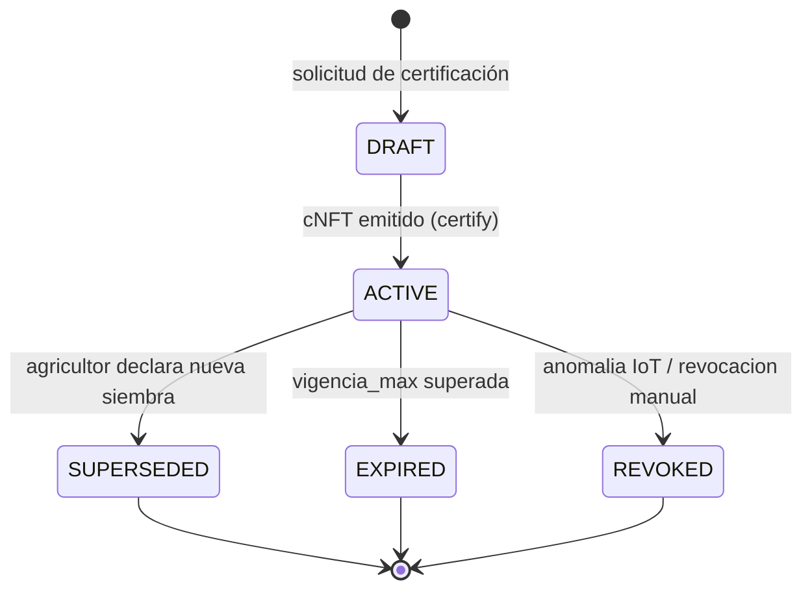
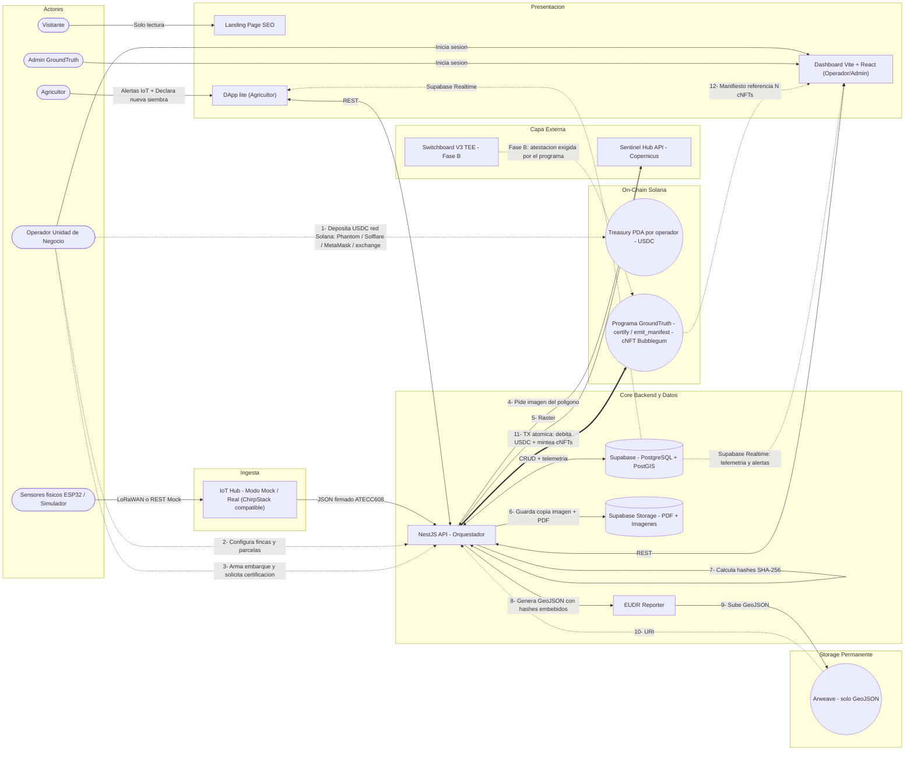
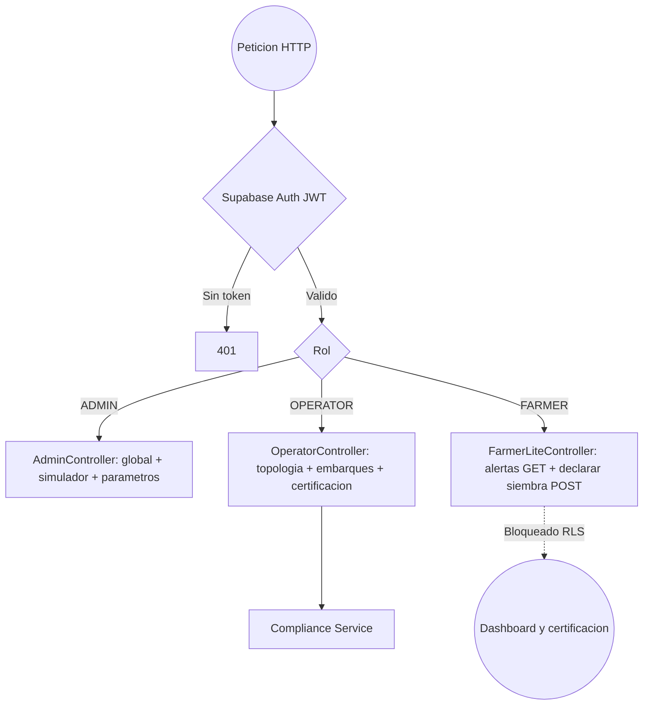
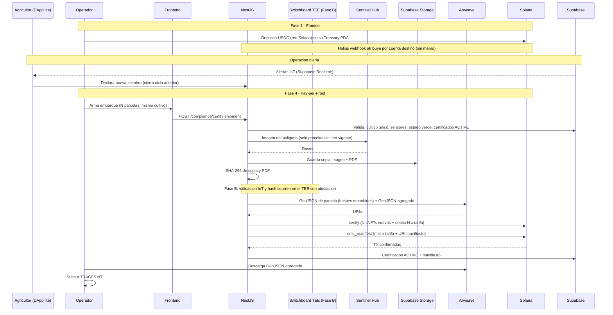
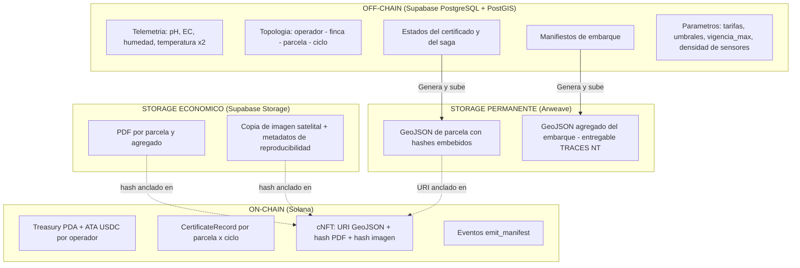
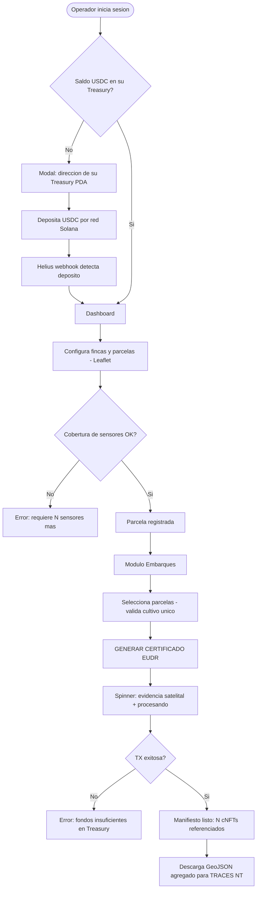
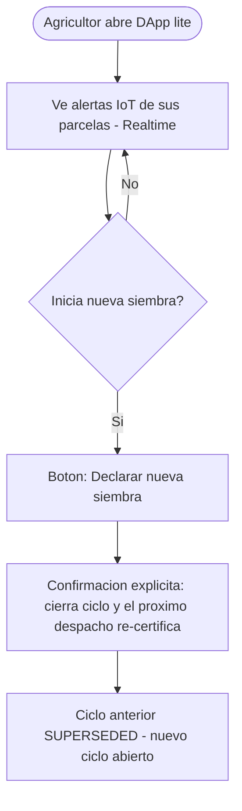

# GroundTruth — Arquitectura Técnica del MVP (v2)

> **Milestone 3 — WayLearn** · Fecha de entrega: Viernes 10 de julio de 2026
> **Objetivo:** claridad técnica antes del desarrollo fuerte del MVP.
> **Criterio de aceptación:** arquitectura comprensible, viable, alineada al flujo de ingresos (Pay-per-Proof), a la validación comercial (LOIs) y a la inmutabilidad jurídica híbrida (IoT + evidencia satelital).

---

## 0. Control del documento

| Documento | Rol | Autoridad |
| --- | --- | --- |
| `Modelo_de_Negocio_GroundTruth.md` | Fuente de verdad de negocio | **Vinculante** |
| `contexto-ground2.md` (este documento) | Arquitectura Técnica del MVP, regenerada desde `contexto-ground1.md` | Documento de trabajo |
| `Roadmap_del_Producto.md` | Referencia temprana | No vinculante |

Este documento integra las **decisiones D1–D10** (registradas en el Anexo A) y mitiga los **puntos de fallo F1–F7** identificados en el análisis previo. Sustituye a `contexto-ground1.md`.

**Correcciones principales respecto a la versión anterior:**

1. Unidad de certificación: de "por parcela suelta" (y "por lectura" en el prototipo) → **por parcela × ciclo de siembra**, con capa de agregación de embarque (D1).
2. La imagen satelital **ya no se descarta** tras hashear: se retiene en Supabase Storage (D4, resuelve F1).
3. El PDF **ya no va a Arweave**: va a Supabase Storage con su hash anclado on-chain; a Arweave solo va el GeoJSON vinculante (D4-bis).
4. Regla de sensores unificada y configurable (D5, resuelve F2).
5. Treasury PDA **por operador** (D8, resuelve F3). Referencia a MetaMask corregida con matiz (soporta Solana nativo desde 2025).
6. Switchboard V3 TEE reintegrado como diseño objetivo con activación escalonada en Fase B (D3).
7. Rol del agricultor redefinido: DApp lite (alertas + declarar siembra), sin acceso al dashboard (D6).
8. Telemetría ampliada a la firma química completa: pH, EC, humedad, temperatura ×2 profundidades, inercia térmica derivada (D7, sobre nodo ESP32).
9. Programa Anchor **nuevo y único** (D9); el prototipo en devnet no se extiende.
10. Canal realtime único (Supabase Realtime, F6) y modelo de auth definido (Supabase Auth + RLS, F7).

---

## 1. Filosofía de diseño

El MVP de GroundTruth es una máquina de conversión de cumplimiento regulatorio EUDR en ingresos automatizados, construida sobre una **prueba híbrida de doble capa**:

- **Prueba química (verdad en el terreno):** la telemetría IoT (pH, conductividad eléctrica, humedad, temperatura a dos profundidades e inercia térmica derivada) demuestra que el suelo corresponde a bosque nativo / cultivo sostenible y no a un monocultivo camuflado (anti-greenwashing).
- **Prueba visual geoespacial:** la imagen satelital más reciente de Sentinel Hub, retenida como copia verificable, cuyo hash SHA-256 se ancla al certificado.

### 1.1 Reglas estrictas de la arquitectura

1. **Cualquier capa técnica puede reemplazarse, excepto el flujo de dinero y la inmutabilidad de la prueba.**
2. **Adopción Web3 progresiva:** Fase 1 (depósito manual USDC) → Fase 2 (transacciones patrocinadas, micropago al agricultor) → Fase 3 (Account Abstraction + rampas FIAT).
3. **Modelo de confianza evolutivo:** MVP (el backend firma) → Fase B escalón 1 (validación IoT en TEE) → Fase B escalón 2 (hash satelital en TEE). El programa on-chain nace con el gate de atestación previsto (stub), de modo que cada escalón sea una activación, no una reescritura.
4. **Optimización de costos por peso y rol (tres capas de almacenamiento):** los archivos pesados nunca van on-chain ni a Arweave. Cada artefacto vive donde su rol lo exige:

| Artefacto | Peso | Rol jurídico | Dónde vive | Qué va on-chain |
| --- | --- | --- | --- | --- |
| **GeoJSON** | KB | Entregable vinculante a aduana (TRACES NT) | **Arweave** (permanente) | Su **URI** |
| **PDF** | MB | Documento legible de respaldo | **Supabase Storage** | Su **hash SHA-256** |
| **Imagen satelital** | MB | Evidencia visual | **Supabase Storage** | Su **hash SHA-256** |
| **Telemetría cruda** | — | Dato operativo | **Supabase (PostgreSQL)** | — |

La fuerza jurídica no vive en los archivos: vive en los **hashes anclados on-chain** y en la **permanencia del GeoJSON** en Arweave. El GeoJSON permanente incluye, embebidos, los hashes del PDF y de la imagen (doble anclaje sin costo adicional).

---

## 2. Modelo de dominio y unidad de certificación (D1)

### 2.1 Jerarquía de entidades

```
Operador (unidad de negocio / cooperativa)
 └── Finca (pertenece a 1 agricultor)
      └── Parcela (1 cultivo; N sensores según área)
           └── Ciclo de siembra (declarado por el agricultor)
                └── Certificado = 1 cNFT por (parcela_id, ciclo_siembra_id)

Embarque = selección transversal N:N de parcelas (de varias fincas, un solo operador)
```

- **Unidad de prueba y de emisión: la parcela.** Cada parcela certificada emite **1 cNFT** con: URI del GeoJSON de parcela (Arweave) + hash del PDF + hash de la imagen satelital + referencia a la PDA de la finca + campo de atestación TEE (reservado, Fase B).
- **Identidad del certificado:** el par `(parcela_id, ciclo_siembra_id)` es la llave de idempotencia. Determina si un despacho reutiliza un cNFT vigente o emite uno nuevo.
- **Lote = parcela (1:1) en el MVP.** El lote comercial multi-parcela queda como extensión (ver §15.E).

### 2.2 Embarque (manifiesto)

- Selección N:N de parcelas de varias fincas pertenecientes a **una sola unidad de negocio**. El caso multi-operador queda como extensión.
- **Regla de unicidad de cultivo:** todas las parcelas de un embarque comparten el mismo cultivo (validador backend + bloqueo en UI).
- El manifiesto es un **registro off-chain** (Supabase) + un **GeoJSON agregado** (`FeatureCollection` con los N polígonos; cada `Feature` lleva como propiedades el asset ID del cNFT, el URI de su GeoJSON de parcela y sus hashes) que se sube a **Arweave** como entregable a TRACES NT, más un PDF agregado en Supabase Storage.
- **No se emite un cNFT de embarque**: el manifiesto referencia los N cNFTs de parcela.

### 2.3 Vigencia del certificado (anclada al ciclo de siembra)

El estado del certificado se gestiona **off-chain (Supabase)** — el cNFT es inmutable y actúa como registro permanente de la emisión; lo que cambia de estado es el registro que gobierna su reutilización.



Reglas:

1. Solo un certificado `ACTIVE` puede reutilizarse en un embarque.
2. **Misma siembra → mismo cNFT.** Si la parcela produce para varios embarques, o la cosecha es escalonada, se reutiliza el certificado sin re-certificar ni re-cobrar certificación.
3. **Nueva siembra → cNFT nuevo.** La declara **el agricultor** desde la DApp lite (con confirmación). Cierra el ciclo anterior (`SUPERSEDED`, se conserva como histórico inmutable).
4. **Tope de seguridad `vigencia_max`, configurable por tipo de cultivo** (café, cacao y aguacate tienen ciclos distintos). Superado el tope sin declaración → `EXPIRED`.
5. **Revocación (`REVOKED`)** por anomalía de telemetría IoT (alerta química) o de forma manual. La parcela no entra a ningún embarque hasta re-certificar. La revocación por detección satelital queda para la fase de monitoreo en tiempo real (§15.D).
6. **Evidencia congelada al emitir:** snapshot de imagen (copia en Supabase Storage), hashes, estado IoT y GeoJSON de esa fecha. Al reutilizar no se re-descarga satélite.

### 2.4 Cobro (Pay-per-Proof)

| Concepto | Cuándo se cobra | Cuánto |
| --- | --- | --- |
| **Tarifa de certificación** | Por cada **cNFT nuevo** emitido (una vez por ciclo de siembra de cada parcela) | `tarifa_certificacion` (parámetro configurable) |
| **Micro-tarifa de manifiesto** | Por cada **embarque** generado, aunque reutilice el 100% de cNFTs vigentes | `tarifa_manifiesto` (parámetro configurable) |
| **Micropago al agricultor** | — | **Fase 2** (transfer hook reservado, desactivado; D2) |

Al despachar un embarque, el sistema: reutiliza los certificados `ACTIVE`, emite (y cobra) los que falten, y cobra la micro-tarifa de manifiesto. Todo se debita de la **Treasury PDA del operador que despacha** (un embarque nunca cruza operadores → una sola tesorería por transacción).

---

## 3. Mapa general de actores y sistema de ingresos



---

## 4. Autenticación, roles y RLS (F7)

**Modelo elegido: Supabase Auth + Row Level Security por rol.** Se descarta el JWT propio en NestJS: Supabase ya está en el stack y RLS da aislamiento por operador sin código adicional.

| Rol | Superficie | Permisos |
| --- | --- | --- |
| `ADMIN` | Dashboard | Global: todas las unidades de negocio, gestión del simulador IoT, parámetros del sistema (tarifas, umbrales, `vigencia_max`, densidad de sensores) |
| `OPERATOR` | Dashboard | Sus fincas/parcelas (RLS por `operador_id`), armado de embarques, solicitud de certificación, vista de tesorería |
| `FARMER` | **Solo DApp lite** | Lectura de alertas IoT de sus parcelas + acción única de escritura: **declarar nueva siembra** (con confirmación). **Bloqueado del dashboard** vía RLS |

**Nota de consistencia (resuelta):** el dashboard operativo es Operador + Admin; el agricultor **sí tiene identidad autenticada**, pero su superficie es exclusivamente la DApp lite. Declarar nueva siembra tiene efecto de cobro futuro (dispara re-certificación en el próximo despacho), por lo que no puede ser una acción anónima.



---

## 5. Telemetría y nodo IoT (D5, D7)

### 5.1 Esquema de telemetría (la "prueba química" con dato que la respalde)

El payload se amplía para sustentar la propuesta de valor. Formato JSON compatible con ChirpStack (hardware futuro = zero changes en el backend):

```json
{
  "node_id": "GT-ESP32-0001",
  "parcela_id": "uuid",
  "ts": "2026-07-10T09:30:00Z",
  "firma": "<firma ATECC608 del payload>",
  "lecturas": {
    "ph": 5.6,
    "ec_us_cm": 480,
    "humedad_suelo_pct": 41.2,
    "temp_suelo_prof1_c": 21.4,
    "temp_suelo_prof2_c": 19.8
  }
}
```

| Variable | Tipo | Origen |
| --- | --- | --- |
| pH del suelo | Lectura directa | Sonda analógica (ADC1) |
| Conductividad eléctrica (EC) | Lectura directa | Sonda analógica (ADC1) |
| Humedad del suelo | Lectura directa | Capacitivo analógico (ADC1) |
| Temperatura del suelo ×2 profundidades | Lectura directa | 2× sensores digitales 1-Wire (pin compartido) |
| **Inercia térmica** | **Métrica derivada** | Calculada por el backend sobre la serie temporal de temperatura a 2 profundidades (amplitud/desfase). No consume pines ni es un campo del payload |

### 5.2 Nodo físico v1 (ESP32) — restricciones documentadas

- Los tres sensores analógicos (pH, EC, humedad) **deben usar el bloque ADC1** (GPIO 32–39): el ADC2 queda inutilizable con la radio (WiFi/LoRa) activa.
- Las 2 sondas de temperatura son digitales 1-Wire y **comparten un solo pin** por direccionamiento.
- **ATECC608** (elemento seguro: firma las lecturas en origen → cadena de custodia criptográfica) y **RTC** (timestamp fiable) van por I²C (2 pines compartidos).
- El ADC del ESP32 no es lineal de fábrica: pH y EC **exigen calibración y acondicionamiento de señal por nodo**. Esto forma parte del ajuste en campo (§15.B), no del MVP.
- El MVP opera con **simulador**: estas restricciones documentan el nodo real sin bloquear nada ahora.

### 5.3 Regla de sensores (D5, resuelve F2)

> **"Mínimo 1 sensor por cada 5.000 m²; se permiten N sensores por parcela según su área."**

- Se **elimina** la regla "un sensor por parcela" (contradecía a la anterior en parcelas grandes).
- El umbral de 5.000 m² es **provisional y configurable** (hipótesis a validar en campo; puede variar por cultivo/topografía).
- **Validación activa (gate):** el sistema calcula la cobertura requerida por área y **bloquea la certificación** si no se cumple, indicando cuántos sensores faltan.
- En el simulador, "asignar N sensores" = instanciar N nodos simulados; el validador cuenta nodos vs área igual que con hardware real.

### 5.4 Simulador

Perfiles diferenciados que demuestran el contraste de la propuesta de valor:

- **"Suelo sano / bosque nativo"** → valores correlacionados en rango verde.
- **"Suelo degradado / monocultivo"** → firma química fuera de umbral → estado rojo → parcela bloqueada para embarque (y `REVOKED` si estaba certificada).

### 5.5 Umbrales EUDR

Los rangos verde/rojo por variable y por cultivo son **parámetros configurables y provisionales** (criterio agronómico/regulatorio a calibrar en terreno), gestionados por el `ADMIN`. La evaluación de umbrales ocurre **off-chain** (backend en el MVP; TEE en Fase B) — nunca on-chain, porque los umbrales son configurables y la telemetría vive en Supabase.

---

## 6. Evidencia satelital (D4, resuelve F1)

**Problema resuelto:** la Process API de Sentinel Hub renderiza al vuelo (evalscript, bandas, bbox, CRS, resolución, formato) y Copernicus reprocesa productos. Dos descargas "de la misma imagen" → bytes distintos → hash distinto. La versión anterior descartaba la imagen tras hashear, dejando el certificado indefendible ante un auditor.

**Mecanismo (retener copia + metadatos):**

1. Al certificar, se descarga la imagen recortada al polígono de la parcela y se **almacena en Supabase Storage**.
2. El **SHA-256 se calcula sobre esa copia almacenada**; ese hash se ancla al cNFT.
3. La verificación del auditor es **contra la copia retenida** → el hash siempre coincide.
4. Junto a la copia se guardan los **metadatos de reproducibilidad**: producto/tile ID de Copernicus, timestamp de adquisición, evalscript versionado, bbox, CRS, resolución, formato. Permiten trazar el producto Copernicus original si se requiere verificación adicional.

**Se revierte la "Nota Arquitectónica Crítica" anterior** (imagen procesada en RAM y descartada). El principio de costos se mantiene: la imagen nunca va a Arweave ni on-chain; se retiene en storage convencional barato.

**Fase B (escalón 2):** la descarga y el guardado ocurren dentro del TEE; la atestación prueba que la copia proviene de una respuesta auténtica de Sentinel Hub, cerrando la objeción "¿y si el operador manipuló su copia?".

---

## 7. Capa on-chain: programa Anchor nuevo y único (D8, D9)

### 7.1 Por qué programa nuevo

El prototipo en devnet (`initialize_farm`, `register_node`, `certify_reading`) certifica **por lectura** y evalúa solo temperatura y humedad; no maneja tesorería USDC, cobro, cNFTs ni atestación. Extenderlo sería reescribir el núcleo alrededor de un esqueleto no diseñado para esto. Se **reutilizan los conceptos** de PDAs determinísticas e identidad (`Farm`, `Node`); el núcleo se parte limpio.

### 7.2 Cuentas (PDAs)

| Cuenta | Seeds | Rol |
| --- | --- | --- |
| `Operator` | `["operator", operador_id]` | Identidad de la unidad de negocio |
| `Treasury` | `["treasury", operador_id]` | Authority de la tesorería del operador. Los USDC viven en su **ATA** (Associated Token Account); solo el programa autoriza débitos vía signer seeds |
| `Farm` | `["farm", finca_id]` | Gemelo digital de la finca (heredado del prototipo) |
| `Parcel` | `["parcel", parcela_id]` | Identidad de la parcela |
| `CertificateRecord` | `["cert", parcela_id, ciclo_id]` | **Idempotencia on-chain**: impide doble emisión para el mismo (parcela, ciclo). Guarda asset ID del cNFT y referencia de evidencia |

### 7.3 Instrucciones

| Instrucción | Qué hace | Débito |
| --- | --- | --- |
| `init_operator_treasury` | Crea Operator + Treasury PDA + ATA | — |
| `register_farm` / `register_parcel` | Registra identidades | — |
| `certify` | **Atómica.** (1) Verifica autorización (firma backend en MVP; **atestación Switchboard en Fase B — gate presente como stub**); (2) crea `CertificateRecord` (falla si ya existe → idempotencia); (3) debita `N × tarifa_certificacion` de la Treasury; (4) mintea N cNFTs vía **CPI a Bubblegum** (ZK Compression) con metadatos: URI GeoJSON (Arweave) + hash PDF + hash imagen | `N × tarifa_certificacion` |
| `emit_manifest` | Debita la micro-tarifa de manifiesto y registra el URI del GeoJSON agregado del embarque (evento on-chain). Se ejecuta en **cada** despacho, incluso si reutiliza el 100% de cNFTs | `tarifa_manifiesto` |

**Reservas de diseño (desactivadas en MVP):** gate de atestación Switchboard (Fase B) y transfer hook de micropago al agricultor (Fase 2). Ambas son activaciones, no reescrituras.

**Atomicidad:** si cualquier paso de `certify` falla (fondos insuficientes, `CertificateRecord` duplicado, atestación inválida en Fase B), la transacción revierte completa — no hay cobro ni mint parcial. La UI muestra "Fondos insuficientes en Treasury" cuando aplica.

**División on-chain / off-chain de la validación:** la evaluación de umbrales EUDR es **off-chain** (backend → TEE en Fase B). El programa exige **autorización** (firma / atestación), no re-evalúa umbrales: son configurables y la telemetría vive en Supabase.

### 7.4 Fondeo de la tesorería (F3 resuelto)

- La dirección de la Treasury es **única y determinística por operador** → el webhook de Helius atribuye cada depósito USDC por la **cuenta destino, sin memo**.
- Aislamiento total: ningún operador puede gastar el USDC de otro.
- El operador deposita desde cualquier wallet o exchange que opere en **red Solana**: Phantom, Solflare, **MetaMask** (con soporte nativo de Solana desde su actualización multichain de 2025) o exchange con retiro USDC-SPL por red Solana. La wallet de origen es indiferente: la atribución la da la dirección destino. Para operación avanzada (firma de transacciones en la dApp), Phantom/Solflare ofrecen mayor profundidad.
- **Red del MVP: devnet con USDC de prueba.** Mainnet queda para producción.

### 7.5 Firmante custodial (F5)

Riesgo: la keypair del backend que firma los mints es un punto único de compromiso.

Mitigación: custodia en **KMS/HSM** (nunca en disco/env plano), **rotación periódica** de llaves, y principio de mínimo privilegio (la keypair solo firma `certify`/`emit_manifest`). El riesgo **se reduce estructuralmente en Fase B**: cuando el programa exige atestación TEE, una keypair comprometida ya no basta para emitir un certificado válido.

---

## 8. Switchboard V3 TEE (D3): modelo de confianza evolutivo

**Diseño objetivo (opción fuerte):** Switchboard Functions ejecuta código dentro de un enclave (TEE) cuya huella (MRENCLAVE) queda registrada; el enclave emite una **atestación** verificable on-chain de que la salida provino exactamente de ese código. El programa Anchor exige la atestación antes de mintear. Dos funciones:

1. **Validación IoT:** las lecturas (pH, EC, humedad, temperatura) se evalúan contra los umbrales EUDR dentro del enclave. El backend deja de ser el validador de la prueba química.
2. **Hash satelital verificable:** la descarga de Sentinel Hub y el cálculo del SHA-256 ocurren dentro de la Function, con las credenciales OAuth2 custodiadas por el mecanismo de *Secrets* del TEE. El hash pasa de "afirmación del backend" a prueba verificable.

**Implementación escalonada (Fase B):**

| Escalón | Quién valida | Qué exige el programa |
| --- | --- | --- |
| **MVP (demo)** | Backend NestJS (firma) | Firma del backend (gate de atestación en stub) |
| **Escalón 1** | TEE valida IoT | Atestación para la prueba química |
| **Escalón 2** | TEE valida IoT + produce hash satelital | Atestación para ambas evidencias |

**Justificación del faseo:** dockerizar la lógica, generar MRENCLAVE, desplegar la Function y verificar atestación añaden complejidad, latencia y costo por ejecución que compiten con tener el flujo end-to-end listo para la validación comercial (LOIs). El faseo replica la lógica de adopción progresiva del producto. Cada escalón reduce además el riesgo del firmante custodial (F5).

---

## 9. Flujo de certificación end-to-end (saga, F4)

### 9.1 Orden del flujo y patrón saga

Estados off-chain del proceso: `CERT_PENDING → EVIDENCE_READY → ONCHAIN_CONFIRMED` (o `FAILED` con reintento idempotente por `certificate_id`).

1. El operador arma el embarque (selección de parcelas; validadores: unicidad de cultivo, cobertura de sensores, estado verde, certificados `ACTIVE` reutilizables vs. faltantes).
2. Para cada parcela **sin certificado vigente**: descarga de imagen → copia + PDF a **Supabase Storage** → cálculo de hashes → GeoJSON de parcela (con hashes embebidos) → **Arweave** → URI.
3. GeoJSON agregado del embarque (FeatureCollection) → **Arweave** → URI del manifiesto.
4. **TX atómica Solana:** `certify` (N cNFTs nuevos + débito) — si N > 0.
5. **TX Solana:** `emit_manifest` (micro-tarifa + registro del URI del manifiesto) — siempre.
6. Confirmación → estados `ACTIVE` en Supabase → el operador descarga el GeoJSON agregado y lo sube a TRACES NT.

**Propiedades del saga:** si la TX on-chain falla tras subir a Arweave, lo único permanente ya pagado es un GeoJSON de kilobytes (costo despreciable — beneficio directo de sacar el PDF de Arweave). El reintento es idempotente: `CertificateRecord` on-chain impide doble mint; `certificate_id` off-chain impide doble cobro. **El costo Arweave/Irys (fondeado por GroundTruth, pagadero en SOL vía Irys) se incluye en el modelo de costos** y queda acotado a kilobytes por certificado.

### 9.2 Diagrama de secuencia



---

## 10. Canal realtime único (F6)

Se elimina el doble canal (Supabase Realtime + WebSockets NestJS). Queda:

- **Supabase Realtime** → telemetría y estados verde/rojo hacia el dashboard, y alertas IoT hacia la DApp lite del agricultor.
- **REST (NestJS)** → comandos y mutaciones (topología, embarques, certificación, declarar siembra).

NestJS deja de exponer WebSockets.

---

## 11. Delimitación estricta de almacenamiento



**Vocabulario inequívoco:** "on-chain" = Solana (solo referencias y valor). Arweave es una red de almacenamiento permanente **independiente de Solana** (el puente lo hace el backend; el pago puede hacerse en SOL vía Irys, pero el archivo vive en Arweave). Supabase Storage es storage convencional económico. Nada pesado toca Solana ni Arweave, con la única excepción del GeoJSON liviano.

---

## 12. Flujos de frontend

### 12.1 Operador (dashboard)



### 12.2 Agricultor (DApp lite)



---

## 13. Dependencias e integraciones críticas

| Dependencia | Uso |
| --- | --- |
| **Sentinel Hub API** (Copernicus Data Space) | Imagen raster del polígono; OAuth2 (credenciales al TEE en Fase B escalón 2) |
| **Helius RPC** | Webhooks de depósito USDC por Treasury PDA |
| **Umi / Bubblegum (Metaplex)** | Minteo de cNFTs con ZK Compression vía CPI |
| **Arweave vía Irys** | Solo GeoJSON (parcela + agregado); pago en SOL; costo incluido en el modelo |
| **Supabase** | PostgreSQL + PostGIS (topología/telemetría), **Storage** (PDF + imágenes), **Auth + RLS**, **Realtime** |
| **ChirpStack + simulador (Faker.js)** | Ingesta IoT modo real/mock, payload compatible |
| **Switchboard V3** (Fase B) | Functions TEE + Attestation Program |
| **Anchor** | Programa único GroundTruth |

---

## 14. Riesgos técnicos y mitigaciones

| # | Riesgo | Mitigación en este diseño |
| --- | --- | --- |
| F1 | Reproducibilidad del hash satelital | **Resuelto (D4/§6):** copia retenida en Supabase Storage + hash de esa copia + metadatos de reproducibilidad |
| F2 | Regla de sensores autocontradictoria | **Resuelto (D5/§5.3):** formulación única por área, configurable, gate activo |
| F3 | Atribución de depósitos USDC | **Resuelto (D8/§7.4):** Treasury PDA por operador; atribución por cuenta destino sin memo |
| F4 | Falla parcial Arweave ↔ Solana | **Mitigado (§9.1):** saga con estados, reintento idempotente (`CertificateRecord` on-chain + `certificate_id` off-chain), sin doble cobro; exposición Arweave acotada a KB; costo Irys incluido |
| F5 | Firmante custodial | **Mitigado (§7.5):** KMS/HSM + rotación + mínimo privilegio; reducción estructural con atestación TEE (Fase B) |
| F6 | Doble canal realtime | **Resuelto (§10):** Supabase Realtime único; NestJS solo REST |
| F7 | Auth sin definir | **Resuelto (§4):** Supabase Auth + RLS; roles ADMIN / OPERATOR / FARMER (este último acotado a la DApp lite) |
| R8 | Nubosidad andina vs imagen satelital | La imagen es la más reciente disponible, nublada o no: es un "timestamp visual complementario". La prueba primaria de sostenibilidad es la química (IoT), que ve lo que la nube tapa. La certificación no se cae por nubosidad |
| R9 | Latencia de descarga satelital | Todo el pipeline de evidencia es asíncrono y **previo** a la TX on-chain (spinner en UI); la TX se firma al final con la evidencia ya lista |
| R10 | Costos on-chain | cNFTs con ZK Compression (fracciones de centavo); archivos pesados fuera de Arweave/Solana; Arweave acotado a GeoJSON en KB |
| R11 | Precisión analógica del nodo v1 | ADC1 del ESP32 no lineal: calibración y acondicionamiento por nodo como requisito del despliegue en campo (§15.B); no bloquea el MVP (simulador) |

---

## 15. Fuera de alcance del MVP / Puntos de extensión (D10)

Delimita qué NO se construye ahora y **dónde se enchufa** cada extensión, para que ninguna sea una reescritura.

**A. Líneas de negocio futuras**
- **Asistente Agronómico IA:** consume la misma telemetría de Supabase que alimenta las alertas IoT. Enchufe: capa de lectura sobre telemetría existente.
- **Data Marketplace & Seguros (DeSci):** consume los datasets certificados que el MVP ya produce; línea de ingreso propia cuando exista dato físico real validado en campo.

**B. Despliegue físico y capa IoT real**
- **Registro en terreno:** técnico clava sensor, GPS del perímetro, QR → gemelo digital (PDA de finca). En el MVP lo sustituye el polígono en Leaflet dibujado por el operador. Enchufe: reemplaza la carga manual de topología.
- **Ajuste y calibración de sensores en campo:** validación de hardware, calibración de pH/EC por nodo, y **recalibración de la densidad de sensores** (¿1 por 5.000 m² o variable por cultivo/topografía?).

**C. Incentivos y pagos al agricultor**
- **Micropago ("fracción de centavo"):** requiere wallet/PDA por finca (nace en el registro en terreno). Enchufe: transfer hook ya reservado en `certify`, desactivado.

**D. Monitoreo satelital en tiempo real**
- Monitoreo continuo por parcela (hoy el satélite es solo soporte puntual de evidencia).
- **Alertas climáticas de detección temprana** (heladas, precipitaciones, riesgo del cultivo) al agricultor.
- **Revocación por cambio detectado vía satélite.** Enchufe: la máquina de estados ya contempla `REVOKED`.

**E. Agregación y multi-operador**
- **cNFT de embarque agregado** (hoy el embarque es manifiesto lógico).
- **Embarque multi-operador** (exportador que agrega varias cooperativas → débito multi-tesorería).
- **Lote comercial multi-parcela** (hoy lote = parcela 1:1).

**F. Adopción Web3 progresiva y canales**
- **Account Abstraction + rampas FIAT** (Fase 3 del negocio). El MVP opera en Fase 1: depósito manual USDC. Enchufe: capa de onboarding sobre la Treasury PDA existente.
- **WhatsApp como canal adicional de entrega** de las mismas alertas IoT que el agricultor ya ve en la DApp lite.

---

## Anexo A — Registro de decisiones (D1–D10)

| # | Decisión | Resumen |
| --- | --- | --- |
| D1 | Unidad de certificación | Por parcela × ciclo de siembra (1 cNFT); embarque = manifiesto lógico sin cNFT propio; unicidad de cultivo; un solo operador por embarque; vigencia por ciclo con estados `DRAFT→ACTIVE→{SUPERSEDED\|EXPIRED\|REVOKED}`; cobro = tarifa por cNFT nuevo + micro-tarifa por manifiesto |
| D2 | Micropago al agricultor | **Fase 2.** Transfer hook reservado y desactivado; requiere PDA por finca y despliegue físico |
| D3 | Switchboard V3 TEE | Opción fuerte como diseño objetivo; **Fase B escalonada**: MVP backend firma → escalón 1 IoT en TEE → escalón 2 satélite en TEE; gate de atestación en stub desde el día 1 |
| D4 | Evidencia satelital | Retener copia en **Supabase Storage** + hash de esa copia + metadatos de reproducibilidad. **Almacenamiento por rol:** GeoJSON→Arweave (URI on-chain); PDF e imagen→Supabase Storage (hashes on-chain); GeoJSON embebe los hashes |
| D5 | Regla de sensores | "Mínimo 1 sensor por cada 5.000 m², N por parcela según área"; provisional, configurable, gate activo |
| D6 | Rol del agricultor | DApp lite: recibe alertas IoT + declara nueva siembra. Sin dashboard. WhatsApp y alertas satelitales a futuro |
| D7 | Telemetría | pH + EC + humedad + temperatura ×2 profundidades (inercia térmica derivada); nodo v1 ESP32 con sensores discretos (ADC1 + 1-Wire + I²C ATECC608/RTC); umbrales configurables provisionales |
| D8 | Tesorería | Treasury PDA por operador (`["treasury", operador_id]`) + ATA; atribución por cuenta destino; devnet USDC; fondeo desde cualquier wallet en red Solana (incl. MetaMask con soporte nativo) |
| D9 | Programa Anchor | **Nuevo y único**; reutiliza conceptos Farm/Node; instrucciones `certify` (atómica, CPI Bubblegum) y `emit_manifest`; `CertificateRecord` para idempotencia; validación de umbrales off-chain, el programa exige autorización |
| D10 | Fuera de alcance | Sección §15 (A–F) con puntos de enchufe explícitos |

### Resoluciones de consistencia aplicadas

1. El agricultor **sí tiene identidad autenticada** (rol `FARMER`), acotada a la DApp lite; el dashboard sigue siendo Operador + Admin.
2. La evaluación de umbrales EUDR es **off-chain** (backend → TEE); el programa on-chain exige autorización, no re-evalúa umbrales.
3. La micro-tarifa de manifiesto tiene **instrucción propia** (`emit_manifest`): se cobra incluso cuando el embarque reutiliza el 100% de certificados.
4. En `certify`, **N = solo cNFTs nuevos**; los reutilizados no re-cobran certificación.
5. La **máquina de estados vive off-chain** (Supabase); el cNFT es inmutable y `CertificateRecord` da idempotencia on-chain.
6. El anclaje del cNFT quedó unificado en todo el documento: **URI GeoJSON (Arweave) + hash PDF + hash imagen (Supabase Storage)**.
