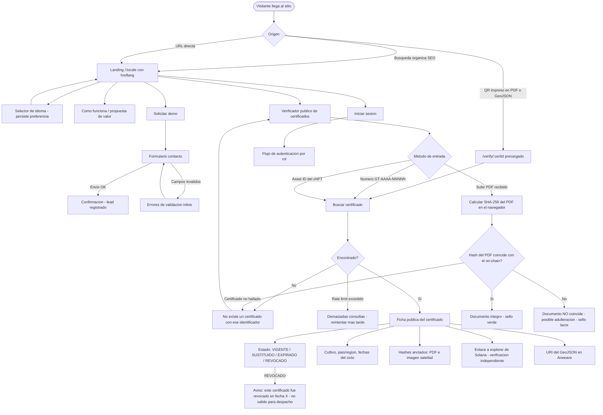
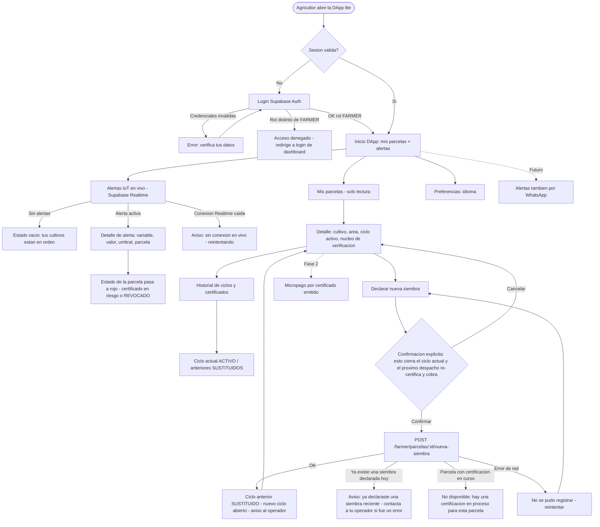
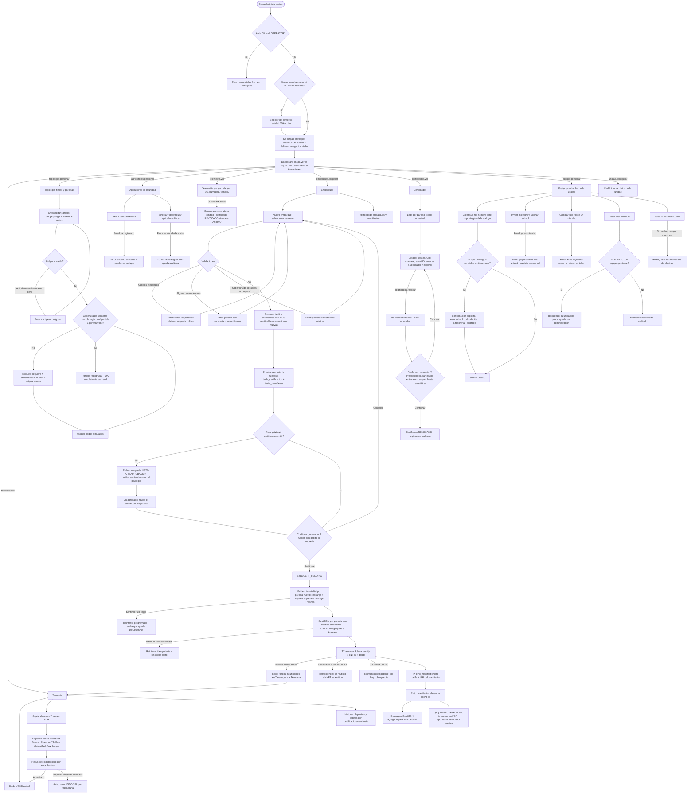

# GroundTruth — Casos de Uso y Flujos por Rol (v1)

> Base para el diseño de navegación y gestión de errores. Cubre los 4 roles: **Visitante** (público + SEO + verificador de certificados), **Agricultor** (DApp lite), **Operador** (unidad de negocio) y **Admin GroundTruth** (máximo control). Cada rol incluye su inventario de casos de uso y su diagrama Mermaid exhaustivo con ramas de error.

---

## 0. Modelo de roles y permisos (RBAC dinámico por unidad)

### 0.1 Jerarquía

```
GroundTruth (ADMIN — máxima autoridad de la plataforma)
 └── Unidad de negocio (cooperativa, asociación, gremio, agrupación de tierras…)
      ├── Miembros operadores: N usuarios, cada uno con un SUB-ROL creado por la propia unidad
      │    └── Sub-rol = conjunto de privilegios tomados del catálogo de la plataforma
      └── Agricultores: N usuarios FARMER (dueños de la tierra), vinculados a sus fincas → DApp lite
```

**Roles de sistema (fijos, definidos por la plataforma):** `ADMIN` · `OPERATOR` (membresía en una unidad, con sub-rol) · `FARMER` · Visitante (sin sesión).
**Sub-roles (dinámicos):** los crea cada unidad a demanda, con el nombre que quiera, combinando privilegios del catálogo. No existen sub-roles predefinidos por la plataforma, salvo el que se siembra al crear la unidad (ver guardarraíles).
**Membresía:** la relación es `usuario × unidad × sub-rol`. Un mismo usuario puede tener membresías en varias unidades y puede además portar el rol `FARMER` (caso agricultor-exportador: es su propia unidad y trabaja su tierra; en UI, selector de contexto dashboard ↔ DApp lite).

### 0.2 Catálogo de privilegios (definido y versionado por la plataforma)

Los privilegios son verbos del dominio; las unidades no los inventan, los combinan. Catálogo del MVP:

| Privilegio | Alcance | Sensible |
| --- | --- | :-: |
| `unidad.configurar` | Datos de la unidad, preferencias | — |
| `equipo.gestionar` | Crear/editar sub-roles, invitar/desactivar miembros, asignar sub-roles | ⚠ |
| `agricultores.gestionar` | Crear cuentas FARMER, vincular/desvincular agricultor↔finca | ⚠ |
| `topologia.gestionar` | CRUD fincas, parcelas, asignación de sensores | — |
| `telemetria.ver` | Series, estados verde/rojo, alertas de la unidad | — |
| `tesoreria.ver` | Saldo, dirección de la Treasury, historial de movimientos | — |
| `embarques.preparar` | Crear embarques, seleccionar parcelas, ver preview de costos (sin ejecutar) | — |
| `certificados.emitir` | Confirmar la generación del certificado — **debita la tesorería** | ⚠⚠ |
| `certificados.revocar` | Revocación manual de certificados de la unidad | ⚠⚠ |
| `certificados.ver` | Lista/detalle de certificados y manifiestos | — |

Los privilegios marcados ⚠⚠ tienen efecto económico u on-chain irreversible; asignarlos a un sub-rol exige confirmación explícita y queda auditado. El catálogo crece cuando la plataforma lanza funcionalidades nuevas (los sub-roles existentes no las reciben automáticamente: cada unidad decide a quién asignárselas).

### 0.3 Guardarraíles (impuestos por la plataforma, no configurables)

1. **Siembra inicial:** al crear una unidad, el Admin crea su primer miembro con un sub-rol autogenerado "Administración de la unidad" que contiene todos los privilegios. Es un sub-rol dinámico más: la unidad puede renombrarlo o crear otros.
2. **Nunca sin timón:** siempre debe existir al menos un miembro activo con `equipo.gestionar`. El sistema bloquea desactivar o degradar al último.
3. **`FARMER` no es un sub-rol:** es rol de sistema con superficie propia (DApp lite). Declarar nueva siembra es exclusivo del agricultor y no es asignable a operadores.
4. **Toda mutación de sub-roles/membresías queda en el registro de auditoría** (quién, cuándo, qué cambió).
5. **Los cambios de privilegios aplican en la siguiente sesión o refresh de token**, nunca de forma retroactiva sobre acciones ya ejecutadas.

### 0.4 Matriz de permisos (por rol de sistema; en Operador, según privilegios del sub-rol)

| Capacidad | Visitante | Agricultor | Operador (privilegio requerido) | Admin |
| --- | :-: | :-: | :-- | :-: |
| Ver landing / SEO / idioma | ✔ | ✔ | ✔ | ✔ |
| **Verificar certificado (sin login)** | ✔ | ✔ | ✔ | ✔ |
| Ver alertas IoT / telemetría | — | ✔ (sus parcelas) | `telemetria.ver` | ✔ (global) |
| Declarar nueva siembra | — | ✔ (sus parcelas) | — (guardarraíl 3) | — |
| Gestionar equipo y sub-roles de la unidad | — | — | `equipo.gestionar` | ✔ (soporte) |
| Crear agricultores / vincular fincas | — | — | `agricultores.gestionar` | ✔ (global) |
| CRUD fincas / parcelas / sensores | — | — | `topologia.gestionar` | ✔ (global) |
| Ver tesorería / historial | — | — | `tesoreria.ver` | ✔ (todas, solo lectura) |
| Preparar embarque (sin ejecutar) | — | — | `embarques.preparar` | — |
| **Generar certificado (debita USDC)** | — | — | `certificados.emitir` | — |
| Revocación manual | — | — | `certificados.revocar` (su unidad) | ✔ (global) |
| Parámetros del sistema y catálogo de privilegios | — | — | — | ✔ |
| Alta de unidades / Operador inicial / simulador / saga / integraciones | — | — | — | ✔ |

Implementación: tabla de membresía `usuario × unidad × sub-rol` + tabla `sub-rol × privilegios`; las políticas RLS de Supabase y los guards de NestJS resuelven contra los privilegios efectivos (claims en el JWT, refrescados al cambiar el sub-rol).

---

## 1. VISITANTE (público, no autenticado)

### 1.1 Casos de uso

- **V1 — Landing multi-idioma (SEO):** propuesta de valor, cómo funciona, precios/contacto. Rutas `/es/…` por defecto, `hreflang`, sitemap por idioma, metadatos localizados. Selector de idioma persistente (cookie/localStorage).
- **V2 — Verificador público de certificados (sin login):** para entidades regulatorias, importadores y auditores.
  - Entradas: (a) **escaneo de QR** impreso en el PDF del certificado y embebido como URL en el GeoJSON; (b) **número de certificado** `GT-AAAA-NNNNN`; (c) **asset ID del cNFT**.
  - Salida pública: estado (`VIGENTE / SUSTITUIDO / EXPIRADO / REVOCADO`), cultivo, país/región, fechas del ciclo, hashes anclados (PDF, imagen satelital), URI del GeoJSON en Arweave, enlace al explorer de Solana.
  - **Verificación de documento:** el visitante puede subir el PDF que recibió; el sistema calcula su SHA-256 en el navegador y lo compara con el hash on-chain → "documento íntegro" o "documento NO coincide".
  - **Privacidad:** no expone nombre del agricultor, contacto, telemetría cruda ni polígono de precisión total (el GeoJSON completo viaja por el canal oficial TRACES NT). Rate-limiting por IP contra scraping.
- **V3 — Solicitar demo / contacto comercial:** formulario breve → lead.
- **V4 — Iniciar sesión:** puerta a los roles autenticados.

### 1.2 Diagrama



---

## 2. AGRICULTOR (DApp lite)

### 2.1 Casos de uso

- **F1 — Autenticación:** login Supabase Auth con rol `FARMER`. RLS lo limita a sus parcelas. Bloqueado del dashboard de gestión.
- **F2 — Ver alertas IoT (Realtime):** alertas de sus cultivos (umbral verde/rojo desde telemetría), en vivo vía Supabase Realtime. Estado vacío si no hay alertas.
- **F3 — Ver estado de sus parcelas (solo lectura):** lista de sus parcelas con estado, cultivo, ciclo activo y núcleo de verificación.
- **F4 — Declarar nueva siembra (única acción de escritura):** por parcela; con confirmación explícita porque cierra el ciclo anterior (pasa a `SUSTITUIDO`) y el próximo despacho re-certifica y cobra.
- **F5 — Ver historial de ciclos y certificados de sus parcelas (solo lectura).**
- **Futuro (fuera de MVP, visible como extensión):** entrega de alertas por WhatsApp; micropago por certificado (Fase 2).

### 2.2 Diagrama



---
## 3. OPERADOR (unidad de negocio / cooperativa)

### 3.1 Casos de uso

- **O1 — Autenticación:** rol `OPERATOR` con membresía `usuario × unidad × sub-rol`; RLS por unidad. La navegación y las acciones visibles se derivan de los **privilegios efectivos** del sub-rol (un miembro sin `tesoreria.ver` no ve el módulo de tesorería). Usuario con membresías en varias unidades o con rol FARMER adicional → selector de contexto al entrar.
- **O2 — Dashboard:** mapa verde/rojo de parcelas (Leaflet), métricas (parcelas activas, certificados vigentes, alertas), saldo de tesorería visible (si tiene `tesoreria.ver`).
- **O3 — Tesorería** (`tesoreria.ver`): ver saldo USDC, copiar dirección de su Treasury PDA, historial de depósitos (detectados por Helius) y de débitos (certificaciones/manifiestos). Depositar = instrucciones + dirección (desde Phantom/Solflare/MetaMask/exchange por red Solana).
- **O4 — Topología** (`topologia.gestionar`): CRUD de fincas y parcelas (polígono en Leaflet, cultivo único, área calculada). **Gate de sensores:** el sistema calcula cobertura requerida (1/5.000 m², configurable) y bloquea el guardado/certificación si no cumple; asignación de nodos (simulados en MVP).
- **O5 — Agricultores** (`agricultores.gestionar`): crear cuentas `FARMER`, vincular/desvincular agricultor↔finca. (Ya no depende del Admin: cada unidad gestiona a su gente.)
- **O6 — Telemetría** (`telemetria.ver`): series por parcela (pH, EC, humedad, temperatura ×2), estado verde/rojo en vivo.
- **O7 — Embarques (núcleo Pay-per-Proof):** preparar (`embarques.preparar`): crear embarque → seleccionar parcelas (validaciones: mismo cultivo, estado verde, cobertura) → clasificación `ACTIVOS` reutilizables vs emisiones nuevas → **preview de costos**. **Ejecutar (`certificados.emitir` — privilegio sensible):** confirmar → saga (satélite → Storage → Arweave → TX Solana) con progreso → manifiesto + GeoJSON agregado para TRACES NT. Quien prepara sin poder emitir deja el embarque **listo para aprobación** de alguien con el privilegio (separación preparador/aprobador).
- **O8 — Certificados** (`certificados.ver`): lista y detalle por parcela×ciclo (estado, hashes, URI Arweave, asset ID, enlaces a verificador público y explorer). **Revocación manual** (`certificados.revocar`), con confirmación y motivo.
- **O9 — Equipo y sub-roles** (`equipo.gestionar`): crear sub-roles a demanda (nombre libre + selección de privilegios del catálogo), invitar miembros, asignar/cambiar sub-rol, desactivar miembros. Guardarraíles: privilegios ⚠⚠ exigen confirmación explícita al asignarse; el sistema impide quedarse sin ningún miembro con `equipo.gestionar`; toda mutación queda auditada.
- **O10 — Perfil/config** (`unidad.configurar`): idioma, datos de la unidad.

### 3.2 Diagrama



---

## 4. ADMIN GROUNDTRUTH (máximo control)

### 4.1 Casos de uso

- **A1 — Gestión de unidades de negocio:** alta de unidad → dispara `init_operator_treasury` (crea Treasury PDA + ATA on-chain) **y siembra el primer miembro** con el sub-rol autogenerado "Administración de la unidad" (todos los privilegios). Baja/suspensión; vista de todas las tesorerías (solo lectura de saldos y movimientos — el Admin nunca gasta fondos de operadores).
- **A2 — Catálogo de privilegios (plataforma):** el Admin mantiene el catálogo versionado de privilegios asignables a sub-roles (los verbos del dominio). Al lanzar una funcionalidad nueva se agrega su privilegio al catálogo; las unidades deciden a qué sub-roles asignarlo. El Admin **no crea sub-roles de las unidades** (eso es de cada unidad), pero puede intervenir como soporte con auditoría (ej. unidad bloqueada sin administrador por caso extremo).
- **A3 — Soporte de usuarios y membresías:** crear/desactivar usuarios de cualquier rol como soporte; resolver vínculos agricultor↔finca en disputa; toda intervención queda auditada. La operación normal (crear agricultores, gestionar equipo) vive en cada unidad.
- **A4 — Parámetros del sistema (todos configurables y versionados):** `tarifa_certificacion`, `tarifa_manifiesto`, umbrales EUDR por variable y por cultivo, `vigencia_max` por cultivo, densidad de sensores (m² por sensor). Cambios con registro de auditoría (quién, cuándo, valor anterior).
- **A5 — Simulador IoT:** iniciar/detener nodos, asignar perfiles ("suelo sano" / "suelo degradado"), inyectar anomalía puntual (para demostrar alerta + revocación en vivo).
- **A6 — Supervisión global:** todas las parcelas/certificados/embarques de todos los operadores; búsqueda transversal.
- **A7 — Auditoría del saga:** cola de certificaciones (`CERT_PENDING`, `FAILED`), reintentos manuales, inspección de errores por paso (satélite/Arweave/Solana).
- **A8 — Revocación global:** revocar cualquier certificado con motivo (casos de fraude o soporte). Rol de **mediador/validador ante entidades regulatorias**: el Admin es el interlocutor de GroundTruth ante auditores; el verificador público reduce esa carga a los casos que requieren intervención humana.
- **A9 — Salud de integraciones:** estado de Sentinel Hub (OAuth vigente), webhooks Helius (últimos eventos), balance SOL para Irys/Arweave (fondeo del storage permanente), RPC Solana, Supabase. Alertas si algo cae.
- **A10 — Operación del firmante (documentado, fuera de UI):** rotación de keypair en KMS/HSM; runbook, no pantalla.

### 4.2 Diagrama

```mermaid
flowchart TD
    A(["Admin inicia sesion"]) --> L{"Auth OK y rol ADMIN?"}
    L -->|No| Le["Acceso denegado"]
    L -->|Si| H["Panel global"]

    H --> OP["Unidades de negocio"]
    OP --> OP1["Alta de unidad"]
    OP1 --> OP2["init_operator_treasury: crea Treasury PDA + ATA"]
    OP2 -->|TX fallida| OP2e["Reintento - unidad queda PENDIENTE_ONCHAIN"]
    OP2 -->|OK| OP2b["Siembra primer miembro con sub-rol Administracion de la unidad - todos los privilegios"]
    OP2b --> OP3["Unidad activa: gestiona su propio equipo y sub-roles"]
    OP --> OP4["Suspender / reactivar unidad"]
    OP4 -->|Con embarque en curso| OP4e["Bloqueado: hay una certificacion en proceso"]
    OP --> OP5["Ver tesorerias - solo lectura de saldos y movimientos"]

    H --> CAT["Catalogo de privilegios - plataforma"]
    CAT --> CAT1["Agregar privilegio al lanzar funcionalidad nueva"]
    CAT1 --> CAT2["Las unidades deciden a que sub-roles asignarlo - nunca es automatico"]
    CAT --> CAT3["Deprecar privilegio"]
    CAT3 -->|En uso por sub-roles| CAT3e["Aviso de impacto: listar unidades afectadas antes de deprecar"]

    H --> U["Soporte de usuarios y membresias - con auditoria"]
    U --> U1["Crear/desactivar usuario de cualquier rol - solo soporte"]
    U1 -->|Email ya registrado| U1e["Error: usuario existente"]
    U --> U2["Resolver vinculo agricultor-finca en disputa"]
    U --> U3["Rescate: unidad sin ningun miembro con equipo.gestionar"]
    U3 --> U3a["Reasignar sub-rol de administracion a un miembro - intervencion auditada"]

    H --> PAR["Parametros del sistema - versionados con auditoria"]
    PAR --> PAR1["Tarifas: certificacion y manifiesto"]
    PAR --> PAR2["Umbrales EUDR por variable y cultivo"]
    PAR --> PAR3["vigencia_max por cultivo"]
    PAR --> PAR4["Densidad de sensores m2 por sensor"]
    PAR1 --> PARv{"Validacion de rangos"}
    PAR2 --> PARv
    PAR3 --> PARv
    PAR4 --> PARv
    PARv -->|Fuera de rango| PARe["Error: valor invalido"]
    PARv -->|OK| PARok["Guardado + registro: quien, cuando, valor anterior"]
    PARok -.-> NOTE1["Los cambios aplican a certificaciones futuras - nunca retroactivos"]

    H --> SIM["Simulador IoT"]
    SIM --> SIM1["Iniciar / detener nodos por parcela"]
    SIM --> SIM2["Perfil: suelo sano / suelo degradado"]
    SIM --> SIM3["Inyectar anomalia puntual"]
    SIM3 --> SIM4["Se dispara alerta al agricultor + parcela en rojo + REVOKED si tenia certificado ACTIVO"]

    H --> SUP["Supervision global: parcelas, certificados, embarques de todos los operadores"]
    SUP --> SUP1["Busqueda transversal por id, cultivo, estado, operador"]

    H --> SAGA["Auditoria del saga de certificacion"]
    SAGA --> SG1["Cola: CERT_PENDING / FAILED por paso"]
    SG1 --> SG2{"Paso fallido"}
    SG2 -->|Sentinel Hub| SG2a["Ver error + reintentar descarga"]
    SG2 -->|Arweave/Irys| SG2b["Ver error + reintentar subida - idempotente"]
    SG2 -->|Solana| SG2c["Ver error + reintentar TX - CertificateRecord evita doble mint"]
    SG2c -->|Fondos insuficientes del operador| SG2d["Notificar al operador - no es accion del Admin"]

    H --> REV["Revocacion global"]
    REV --> REV1{"Confirmar con motivo - irreversible"}
    REV1 -->|Confirmar| REV2["Certificado REVOCADO en cualquier operador + auditoria"]

    H --> INT["Salud de integraciones"]
    INT --> I1["Sentinel Hub: OAuth vigente / caido"]
    INT --> I2["Helius: ultimos webhooks recibidos"]
    INT --> I3["Irys/Arweave: balance SOL para storage - alerta si bajo"]
    I3 -->|Balance bajo| I3e["Accion: fondear cuenta Irys o las certificaciones fallaran"]
    INT --> I4["RPC Solana y Supabase: latencia y estado"]
```



---

## 5. Notas transversales para navegación y errores (siguiente fase)

1. **Autenticación y expiración de sesión:** cualquier 401 en cualquier rol → redirige a login conservando la ruta de retorno. El rol determina el shell de navegación (dashboard vs DApp lite); un `FARMER` que intenta una ruta de dashboard recibe 403 con redirección, nunca un shell vacío.
2. **Errores del saga son asincrónicos:** el operador no espera bloqueado; el embarque queda `PENDIENTE` con progreso visible (núcleo de suelo como barra) y notificación al resolverse. Los reintentos son idempotentes: la UI nunca ofrece "reintentar" de forma que pueda duplicar cobro o mint.
3. **Toda acción con efecto económico u on-chain exige confirmación explícita con consecuencias en texto claro:** declarar siembra (agricultor), generar certificado (operador), revocar (operador/admin), cambiar tarifas (admin).
4. **El verificador público es la única superficie sin auth** y debe funcionar sin JavaScript pesado (SEO + accesibilidad para entidades), con rate-limiting.
5. **Estados vacíos y de carga definidos por pantalla** (sin alertas, sin parcelas, sin embarques): invitación a la acción, no disculpa.
6. **i18n aplica a todos los diagramas:** cada etiqueta de estos flujos corresponde a una clave de diccionario, nunca a texto quemado.
