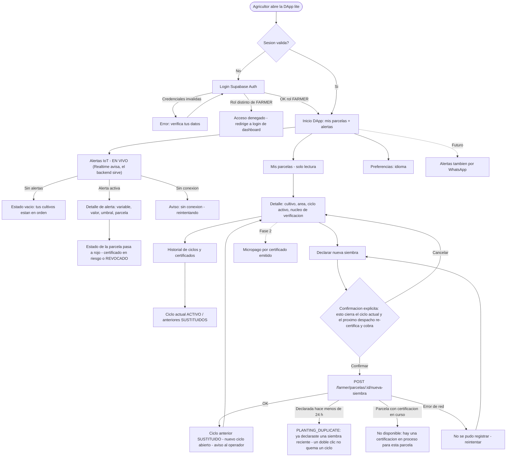
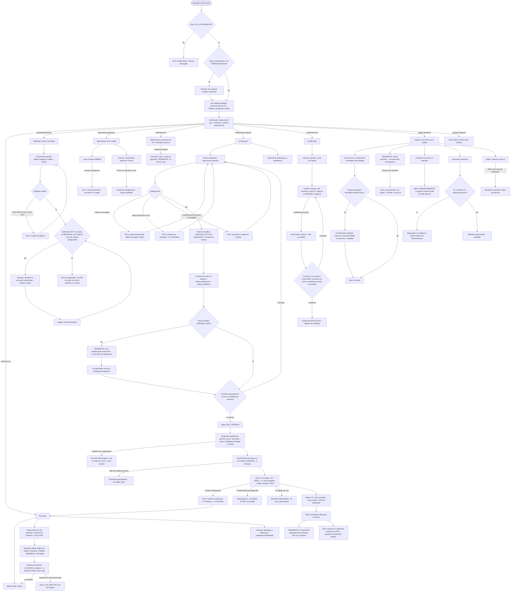

# GroundTruth — Casos de Uso y Flujos por Rol (v1)

> Base para el diseño de navegación y gestión de errores. Cubre los 4 roles: **Visitante** (público + SEO + verificador de certificados), **Agricultor** (DApp lite), **Operador** (unidad de negocio) y **Admin GroundTruth** (máximo control). Cada rol incluye su inventario de casos de uso y su diagrama Mermaid exhaustivo con ramas de error.

### Estado de implementación

Contrastado contra el código (julio 2026): ✅ construido · ⚠️ construido con divergencia · 🔜 no construido, sigue en pie.

---

## 0. Modelo de roles y permisos (RBAC dinámico por unidad)

### 0.1 Jerarquía

```
GroundTruth (ADMIN — máxima autoridad de la plataforma)
 └── Unidad de negocio (cooperativa, asociación, gremio, agrupación de tierras…)
      ├── Miembros operadores: N usuarios, cada uno con un SUB-ROL creado por la propia unidad
      │    └── Sub-rol = conjunto de privilegios tomados del catálogo de la plataforma
      └── Agricultores: N usuarios FARMER (dueños de la tierra), vinculados a sus fincas → DApp lite
```

**⚠️ "Rol ≠ persona": no existe una columna `rol`.** Los roles se **derivan**: eres *operador* si tienes una membresía activa; *agricultor* si eres dueño de una finca; *admin de plataforma* si `usuarios.es_admin`. Una persona puede ser operadora y agricultora a la vez, y `GET /me` devuelve ambas superficies. Visitante = sin sesión.
**Sub-roles (dinámicos):** los crea cada unidad a demanda, con el nombre que quiera, combinando privilegios del catálogo. No existen sub-roles predefinidos por la plataforma, salvo el que se siembra al crear la unidad (ver guardarraíles).
**Membresía:** la relación es `usuario × unidad × sub-rol`. Un mismo usuario puede tener membresías en varias unidades y puede además portar el rol `FARMER` (caso agricultor-exportador: es su propia unidad y trabaja su tierra; en UI, selector de contexto dashboard ↔ DApp lite).

### 0.2 Catálogo de privilegios (definido y versionado por la plataforma)

Los privilegios son verbos del dominio; las unidades no los inventan, los combinan. Catálogo del MVP:

| Privilegio | Alcance | Sensible |
| --- | --- | :-: |
| `unidad.configurar` | Datos de la unidad, preferencias | — |
| `equipo.gestionar` | Crear/editar sub-roles, invitar/desactivar miembros, asignar sub-roles | ⚠ |
| `agricultores.gestionar` | Crear cuentas FARMER, vincular/desvincular agricultor↔finca | ⚠ |
| `topologia.gestionar` | CRUD fincas, parcelas, asignación de sensores | — |
| `telemetria.ver` | Series, estados verde/rojo, alertas de la unidad | — |
| `tesoreria.ver` | Saldo, dirección de la Treasury, historial de movimientos | — |
| `embarques.preparar` | Crear embarques, seleccionar parcelas, ver preview de costos (sin ejecutar) | — |
| `certificados.emitir` | Confirmar la generación del certificado — **debita la tesorería** | ⚠⚠ |
| `certificados.revocar` | Revocación manual de certificados de la unidad | ⚠⚠ |
| `certificados.ver` | Lista/detalle de certificados y manifiestos | — |

✅ **El catálogo está implementado exactamente así (los 10).** ⚠️ **Solo `certificados.emitir` y `certificados.revocar` están marcados como sensibles** en la base; `equipo.gestionar` y `agricultores.gestionar` (marcados ⚠ arriba) **no lo están**. Los sensibles tienen efecto económico irreversible; asignarlos exige confirmación explícita y queda auditado. El catálogo crece cuando la plataforma lanza funcionalidades nuevas (los sub-roles existentes no las reciben automáticamente: cada unidad decide a quién asignárselas).

### 0.3 Guardarraíles (impuestos por la plataforma, no configurables)

1. ✅ **Siembra inicial:** al crear una unidad se siembra su primer miembro con un sub-rol autogenerado que contiene todos los privilegios vigentes. *(Se llama **"Dirección"**, no "Administración de la unidad".)*
2. ✅ **Nunca sin timón:** siempre debe existir al menos un miembro activo con `equipo.gestionar`. Lo impone un **trigger en la base de datos** —no solo la aplicación— y también se comprueba al desactivar un usuario desde el Admin.
3. ✅ **El agricultor no es un sub-rol:** su superficie (DApp lite) se autoriza **por propiedad de la finca**, no por privilegio. Declarar nueva siembra es exclusivo suyo.
4. ✅ **Toda mutación de sub-roles/membresías queda auditada** (quién, cuándo, qué cambió).
5. ⚠️ **Los cambios de privilegios aplican INMEDIATAMENTE**, no "en la siguiente sesión o refresh de token" como decía este documento. `PrivilegesGuard` **consulta la base en cada petición**; no hay claims en el JWT. Es más simple y más seguro: revocar un privilegio surte efecto al instante, sin esperar a que caduque un token.
6. ✅ **Deprecar un privilegio** deja de poder **asignarse** a sub-roles nuevos, pero quien ya lo tiene lo conserva: no se rompe a nadie en caliente.

### 0.4 Matriz de permisos (por rol de sistema; en Operador, según privilegios del sub-rol)

| Capacidad | Visitante | Agricultor | Operador (privilegio requerido) | Admin |
| --- | :-: | :-: | :-- | :-: |
| Ver landing / SEO / idioma | ✔ | ✔ | ✔ | ✔ |
| **Verificar certificado (sin login)** | ✔ | ✔ | ✔ | ✔ |
| Ver alertas IoT / telemetría | — | ✔ (sus parcelas) | `telemetria.ver` | ✔ (global) |
| Declarar nueva siembra | — | ✔ (sus parcelas) | — (guardarraíl 3) | — |
| Gestionar equipo y sub-roles de la unidad | — | — | `equipo.gestionar` | ✔ (soporte) |
| Crear agricultores / vincular fincas | — | — | `agricultores.gestionar` | ✔ (global) |
| CRUD fincas / parcelas / sensores | — | — | `topologia.gestionar` | ✔ (global) |
| Ver tesorería / historial | — | — | `tesoreria.ver` | ✔ (todas, solo lectura) |
| Preparar embarque (sin ejecutar) | — | — | `embarques.preparar` | — |
| **Generar certificado (debita USDC)** | — | — | `certificados.emitir` | — |
| Revocación manual | — | — | `certificados.revocar` (su unidad) | ✔ (global) |
| Parámetros del sistema y catálogo de privilegios | — | — | — | ✔ |
| Alta de unidades / Operador inicial / simulador / saga / integraciones | — | — | — | ✔ |

⚠️ **Implementación (corregida).** Tabla de membresía `usuario × unidad × sub-rol` + tabla `sub-rol × privilegios`. **RLS aísla FILAS; NestJS autoriza ACCIONES** — nunca se mezclan. **No hay claims de privilegios en el JWT:** `PrivilegesGuard` consulta la base en cada petición (con la cabecera `x-operador-id`), y `AdminGuard` comprueba `usuarios.es_admin` sin cabecera de unidad, porque el Admin no pertenece a ninguna.

---

## 1. VISITANTE (público, no autenticado)

### 1.1 Casos de uso

- **V1 — Landing multi-idioma (SEO):** propuesta de valor, cómo funciona, precios/contacto. Rutas `/es/…` por defecto, `hreflang`, sitemap por idioma, metadatos localizados. Selector de idioma persistente (cookie/localStorage).
- ✅ **V2 — Verificador público de certificados (sin login).** La superficie que usan entidades regulatorias, importadores y auditores. **Sin autenticación por diseño:** si hiciera falta pedirnos permiso para comprobar un certificado, el certificado no probaría nada.
  - **Tres entradas:** número `GT-AAAA-NNNNN` · asset ID del cNFT · **subir el PDF recibido** (su SHA-256 se calcula **en el navegador** con `crypto.subtle`: el documento nunca sale de su máquina).
  - **Salida:** estado, cultivo, país, fechas, hashes anclados (PDF e imagen), **asset ID con enlace al explorer de Solana** y **URI del GeoJSON en Arweave** — lo que permite la **verificación independiente**: quien recibe el documento lo comprueba contra la cadena **sin fiarse de esta página**.
  - **Privacidad:** lee *exclusivamente* de la vista `certificados_publicos` (Modelo-de-Datos §7.1). **Nunca** el nombre del agricultor, su contacto, la telemetría cruda ni el polígono. Consultar la tabla `certificados` desde aquí expondría el tenant entero; por eso no se hace, ni "solo para un campo".
  - **Rate-limiting por IP** (30/min): cada respuesta suelta es inocua, pero sin freno cualquiera podría recorrer el espacio de números y **enumerar quién exporta qué y desde dónde**. El daño está en el agregado. *(Limitación honesta: el contador vive en memoria del proceso; con varias réplicas hay que llevarlo a Redis o al borde.)*
  - Entradas: (a) **escaneo de QR** impreso en el PDF del certificado y embebido como URL en el GeoJSON; (b) **número de certificado** `GT-AAAA-NNNNN`; (c) **asset ID del cNFT**.
  - Salida pública: estado (`VIGENTE / SUSTITUIDO / EXPIRADO / REVOCADO`), cultivo, país/región, fechas del ciclo, hashes anclados (PDF, imagen satelital), URI del GeoJSON en Arweave, enlace al explorer de Solana.
  - **Verificación de documento:** el visitante puede subir el PDF que recibió; el sistema calcula su SHA-256 en el navegador y lo compara con el hash on-chain → "documento íntegro" o "documento NO coincide".
  - **Privacidad:** no expone nombre del agricultor, contacto, telemetría cruda ni polígono de precisión total (el GeoJSON completo viaja por el canal oficial TRACES NT). Rate-limiting por IP contra scraping.
- ✅ **V1 — Landing multi-idioma:** construida, 7 idiomas.
- ⚠️ **V3 — Solicitar demo / contacto comercial:** el formulario existe; **no persiste el lead** en ninguna parte.
- ✅ **V4 — Iniciar sesión.**

### 1.2 Diagrama


---

## 2. AGRICULTOR (DApp lite)

### 2.1 Casos de uso

- ✅ **F1 — Autenticación:** login Supabase Auth. Su superficie se autoriza **por propiedad de la finca** (sin `x-operador-id`), no por un rol fijo.
- ✅ **F2 — Ver alertas IoT: EN VIVO.** Suscripción a `alertas` vía Supabase Realtime. El evento solo **avisa**; la alerta la sirve el backend (RLS acota a las fincas del agricultor). Si el canal cae, la vista lo dice y sigue funcionando por *refetch*.
- ✅ **F3 — Ver estado de sus parcelas (solo lectura).**
- ✅ **F4 — Declarar nueva siembra:** con confirmación explícita (cierra el ciclo anterior y el próximo despacho re-certifica **y cobra**). **Guardarraíl real:** bloqueado si el ciclo actual se declaró hace menos de 24 h (`PLANTING_DUPLICATE`) — un doble clic no puede quemar un ciclo.
- ✅ **F5 — Ver historial de ciclos y certificados de sus parcelas.**
- **Futuro (fuera de MVP, visible como extensión):** entrega de alertas por WhatsApp; micropago por certificado (Fase 2).

### 2.2 Diagrama



---
## 3. OPERADOR (unidad de negocio / cooperativa)

### 3.1 Casos de uso

- **O1 — Autenticación:** rol `OPERATOR` con membresía `usuario × unidad × sub-rol`; RLS por unidad. La navegación y las acciones visibles se derivan de los **privilegios efectivos** del sub-rol (un miembro sin `tesoreria.ver` no ve el módulo de tesorería). Usuario con membresías en varias unidades o con rol FARMER adicional → selector de contexto al entrar.
- **O2 — Dashboard:** mapa verde/rojo de parcelas (Leaflet), métricas (parcelas activas, certificados vigentes, alertas), saldo de tesorería visible (si tiene `tesoreria.ver`).
- ⚠️ **O3 — Tesorería** (`tesoreria.ver`): saldo USDC, **dirección de depósito = el ATA de su tesorería** (⚠️ **no la Treasury PDA**, como decía este documento: la PDA está fuera de la curva y varias wallets se niegan a enviarle tokens), historial de depósitos y débitos. **La cadena es la fuente de verdad**: el backend reconcilia leyéndola; el webhook de Helius solo avisa.
- ⚠️ **O4 — Topología** (`topologia.gestionar`): fincas y parcelas ya son **dos listados separados**, ambos con filtros, orden por columna y paginación resueltos en el backend (`/dashboard/fincas`, `/dashboard/topologia`). **Alta de finca fusionada con alta de agricultor** en un único paso (`/dashboard/fincas/nueva`): un formulario, una `OnchainProgressModal` de 2 pasos ("crear finca" → "asignar agricultor"), una transacción atómica. Si el email del agricultor ya existe y está activo, **se reutiliza** (mismo patrón `upsertUsuario` que el alta de unidad); si no, se invita de verdad por Supabase Auth y recibe email para fijar contraseña **después** del commit. Alta de parcela (polígono en Leaflet, cultivo, nodos) sigue igual: **gate de sensores impuesto por el SERVIDOR** con el área calculada por PostGIS — no por el navegador. ⚠️ **El umbral por defecto es 20.000 m² (2 ha por sensor), no 1/5.000 m²**; es configurable por el Admin. Rechaza polígonos inválidos (uno que se cruza a sí mismo tiene área, pero no es una parcela). **Los nodos nacen con la parcela** (un nodo "libre" no existe en el modelo). 🔜 Falta el **borrado/edición** de parcelas.
- **O5 — Agricultores** (`agricultores.gestionar`): el alta normal es la fusionada de O4 (`/dashboard/fincas/nueva`); crear un agricultor **suelto** (sin finca todavía) sigue existiendo como caso aparte para alta anticipada, con el mismo listado con filtros/orden/paginación (nombre, email, finca). ✅ **El agricultor ya recibe invitación real por Supabase Auth** y puede iniciar sesión (el 🔴 de la versión anterior de este documento quedó resuelto). ⚠️ Sigue sin existir "vincular/desvincular agricultor↔finca" como acción independiente sobre una finca ya creada — la finca muestra su agricultor asociado (nombre + email) pero no hay UI de reasignación (el endpoint backend existe, `PATCH /agricultores/fincas/:fincaId`, pero no está expuesto en el listado de fincas).
- **O6 — Telemetría** (`telemetria.ver`): series por parcela (pH, EC, humedad, temperatura ×2), estado verde/rojo en vivo.
- ⚠️ **O7 — Embarques (núcleo Pay-per-Proof):** ✅ preparar (`embarques.preparar`) con sus validaciones (mismo cultivo, sin parcelas en rojo, ciclo activo), clasificación de reutilizables vs nuevos y **preview de costos** leído de los parámetros reales. ✅ **Ejecutar** (`certificados.emitir`): saga de 3 fases → evidencia → **una sola TX** (N `certify` + 1 `emit_manifest`) → si falla, **no se cobra nada**.
  - 🔜 **La separación preparador/aprobador NO está implementada.** El estado `LISTO_APROBACION` existe en la base pero **ninguna transición lo usa**: hoy quien no tiene `certificados.emitir` simplemente recibe 403.
  - 🔜 **El GeoJSON agregado del embarque —el entregable a TRACES NT— aún no se genera.** Solo los de parcela.
- **O8 — Certificados** (`certificados.ver`): lista y detalle por parcela×ciclo (estado, hashes, URI Arweave, asset ID, enlaces a verificador público y explorer). **Revocación manual** (`certificados.revocar`), con confirmación y motivo.
- ⚠️ **O9 — Equipo y sub-roles** (`equipo.gestionar`): ✅ crear sub-roles a demanda (nombre libre + privilegios del catálogo), cambiar el sub-rol de un miembro, eliminar sub-roles (bloqueado si están en uso). ✅ El guardarraíl **"nunca sin timón"** lo impone un trigger de la base. 🔜 **"Invitar miembros" NO existe**: no hay flujo de invitación.
- **O10 — Perfil/config** (`unidad.configurar`): idioma, datos de la unidad.

### 3.2 Diagrama

> ⚠️ El nodo `AGR2` ("Vincular / desvincular agricultor a finca") describe el flujo **previo**
> a la fusión: hoy el alta normal de agricultor ocurre junto con la finca en un solo paso
> (`/dashboard/fincas/nueva`, ver O4/O5 arriba). El endpoint de reasignación sigue existiendo
> en el backend, pero no está expuesto como acción independiente en ningún listado todavía.



---

## 4. ADMIN GROUNDTRUTH (máximo control)

### 4.1 Casos de uso

- ⚠️ **A1 — Gestión de unidades:** ✅ el alta **siembra el primer miembro** con el sub-rol autogenerado (**"Dirección"**, con todos los privilegios). ⚠️ **NO dispara `init_operator_treasury`**, como decía este documento: la unidad nace **`PENDIENTE_ONCHAIN` y sin Treasury PDA**. Su tesorería es una cuenta on-chain que se crea aparte; hasta entonces la unidad **puede configurarse pero no certificar**. ✅ Suspender/reactivar **muerde de verdad**: una unidad suspendida no puede emitir (`UNIT_NOT_ACTIVE`). ✅ Vista de tesorerías en solo lectura.
- **A2 — Catálogo de privilegios (plataforma):** el Admin mantiene el catálogo versionado de privilegios asignables a sub-roles (los verbos del dominio). Al lanzar una funcionalidad nueva se agrega su privilegio al catálogo; las unidades deciden a qué sub-roles asignarlo. El Admin **no crea sub-roles de las unidades** (eso es de cada unidad), pero puede intervenir como soporte con auditoría (ej. unidad bloqueada sin administrador por caso extremo).
- **A3 — Soporte de usuarios y membresías:** crear/desactivar usuarios de cualquier rol como soporte; resolver vínculos agricultor↔finca en disputa; toda intervención queda auditada. La operación normal (crear agricultores, gestionar equipo) vive en cada unidad.
- **A4 — Parámetros del sistema (todos configurables y versionados):** `tarifa_certificacion`, `tarifa_manifiesto`, umbrales EUDR por variable y por cultivo, `vigencia_max` por cultivo, densidad de sensores (m² por sensor). Cambios con registro de auditoría (quién, cuándo, valor anterior).
- ⚠️ **A5 — Simulador IoT:** ✅ activar/desactivar nodos y **generar telemetría real** con perfil sano/degradado. Los valores **se derivan de los umbrales de la base**: si el Admin los cambia, el simulador cambia con ellos. El perfil degradado **levanta la alerta que ve el agricultor**. 🔜 **No revoca el certificado automáticamente** — la revocación es manual.
- **A6 — Supervisión global:** todas las parcelas/certificados/embarques de todos los operadores; búsqueda transversal.
- **A7 — Auditoría del saga:** cola de certificaciones (`CERT_PENDING`, `FAILED`), reintentos manuales, inspección de errores por paso (satélite/Arweave/Solana).
- **A8 — Revocación global:** revocar cualquier certificado con motivo (casos de fraude o soporte). Rol de **mediador/validador ante entidades regulatorias**: el Admin es el interlocutor de GroundTruth ante auditores; el verificador público reduce esa carga a los casos que requieren intervención humana.
- ⚠️ **A9 — Salud de integraciones:** ✅ el panel pregunta a los servicios **reales**. Hoy solo se sondean Supabase y el RPC de Solana; **Sentinel y Helius aparecen como "no configurada"** en vez de fingir un "ok" — un panel de salud que miente es peor que no tenerlo. 🔜 Falta el balance de SOL para Irys.
- 🔴 **A10 — Operación del firmante: NO implementado.** La keypair del backend está **en un `.env` en texto plano** (riesgo F5). Quien lea ese fichero puede emitir certificados falsos. KMS/HSM pendiente.

### 4.2 Diagrama

```mermaid
flowchart TD
    A(["Admin inicia sesion"]) --> L{"Auth OK y rol ADMIN?"}
    L -->|No| Le["Acceso denegado"]
    L -->|Si| H["Panel global"]

    H --> OP["Unidades de negocio"]
    OP --> OP1["Alta de unidad"]
    OP1 --> OP2["Crea la unidad + su sub-rol Direccion. NO crea la Treasury PDA"]
    OP2 --> OP2e["Unidad nace PENDIENTE_ONCHAIN: configurable, pero NO puede certificar"]
    OP2e --> OP2b["Siembra el primer miembro con el sub-rol Direccion - todos los privilegios"]
    OP2b --> OP3["Unidad activa: gestiona su propio equipo y sub-roles"]
    OP --> OP4["Suspender / reactivar unidad"]
    OP4 -->|Con embarque en curso| OP4e["Bloqueado: hay una certificacion en proceso"]
    OP --> OP5["Ver tesorerias - solo lectura de saldos y movimientos"]

    H --> CAT["Catalogo de privilegios - plataforma"]
    CAT --> CAT1["Agregar privilegio al lanzar funcionalidad nueva"]
    CAT1 --> CAT2["Las unidades deciden a que sub-roles asignarlo - nunca es automatico"]
    CAT --> CAT3["Deprecar privilegio"]
    CAT3 -->|En uso por sub-roles| CAT3e["Aviso de impacto: listar unidades afectadas antes de deprecar"]

    H --> U["Soporte de usuarios y membresias - con auditoria"]
    U --> U1["Crear/desactivar usuario de cualquier rol - solo soporte"]
    U1 -->|Email ya registrado| U1e["Error: usuario existente"]
    U --> U2["Resolver vinculo agricultor-finca en disputa"]
    U --> U3["Rescate: unidad sin ningun miembro con equipo.gestionar"]
    U3 --> U3a["Reasignar sub-rol de administracion a un miembro - intervencion auditada"]

    H --> PAR["Parametros del sistema - versionados con auditoria"]
    PAR --> PAR1["Tarifas: certificacion y manifiesto"]
    PAR --> PAR2["Umbrales EUDR por variable y cultivo"]
    PAR --> PAR3["vigencia_max por cultivo"]
    PAR --> PAR4["Densidad de sensores m2 por sensor"]
    PAR1 --> PARv{"Validacion de rangos"}
    PAR2 --> PARv
    PAR3 --> PARv
    PAR4 --> PARv
    PARv -->|Fuera de rango| PARe["Error: valor invalido"]
    PARv -->|OK| PARok["Guardado + registro: quien, cuando, valor anterior"]
    PARok -.-> NOTE1["Los cambios aplican a certificaciones futuras - nunca retroactivos"]

    H --> SIM["Simulador IoT"]
    SIM --> SIM1["Iniciar / detener nodos por parcela"]
    SIM --> SIM2["Perfil: suelo sano / suelo degradado"]
    SIM --> SIM3["Inyectar anomalia puntual"]
    SIM3 --> SIM4["Alerta al agricultor + parcela en rojo. PENDIENTE: no revoca sola"]

    H --> SUP["Supervision global: parcelas, certificados, embarques de todos los operadores"]
    SUP --> SUP1["Busqueda transversal por id, cultivo, estado, operador"]

    H --> SAGA["Auditoria del saga de certificacion"]
    SAGA --> SG1["Cola: CERT_PENDING / FAILED por paso"]
    SG1 --> SG2{"Paso fallido"}
    SG2 -->|Sentinel Hub| SG2a["Ver error + reintentar descarga"]
    SG2 -->|Arweave/Irys| SG2b["Ver error + reintentar subida - idempotente"]
    SG2 -->|Solana| SG2c["Ver error + reintentar TX - CertificateRecord evita doble mint"]
    SG2c -->|Fondos insuficientes del operador| SG2d["Notificar al operador - no es accion del Admin"]

    H --> REV["Revocacion global"]
    REV --> REV1{"Confirmar con motivo - irreversible"}
    REV1 -->|Confirmar| REV2["Certificado REVOCADO en cualquier operador + auditoria"]

    H --> INT["Salud de integraciones"]
    INT --> I1["Sentinel Hub: NO CONFIGURADO - se declara, no se finge un OK"]
    INT --> I2["Helius: ultimos webhooks recibidos"]
    INT --> I3["PENDIENTE: balance SOL de Irys"]
    I3 -->|Balance bajo| I3e["Accion: fondear cuenta Irys o las certificaciones fallaran"]
    INT --> I4["RPC Solana y Supabase: latencia y estado"]
```



---

## 5. Notas transversales para navegación y errores (siguiente fase)

1. **Autenticación y expiración de sesión:** cualquier 401 en cualquier rol → redirige a login conservando la ruta de retorno. El rol determina el shell de navegación (dashboard vs DApp lite); un `FARMER` que intenta una ruta de dashboard recibe 403 con redirección, nunca un shell vacío.
2. ⚠️ **Errores del saga:** los reintentos **sí son idempotentes** (el `CertificateRecord` on-chain impide el doble mint y el doble cobro — verificado). 🔜 **Pero el modal NO es recuperable**: si el operador lo cierra a media saga, no puede volver a verlo. Hoy la red de seguridad es el **Admin**, que ve la cola del saga y reintenta.
3. **Toda acción con efecto económico u on-chain exige confirmación explícita con consecuencias en texto claro:** declarar siembra (agricultor), generar certificado (operador), revocar (operador/admin), cambiar tarifas (admin).
4. ✅ **El verificador público es la única superficie sin auth**, con rate-limiting por IP y lectura exclusiva de la vista pública. 🔜 Falta que funcione **sin JavaScript pesado** (SEO + accesibilidad para entidades): hoy es una SPA.
5. **Estados vacíos y de carga definidos por pantalla** (sin alertas, sin parcelas, sin embarques): invitación a la acción, no disculpa.
6. **i18n aplica a todos los diagramas:** cada etiqueta de estos flujos corresponde a una clave de diccionario, nunca a texto quemado.
