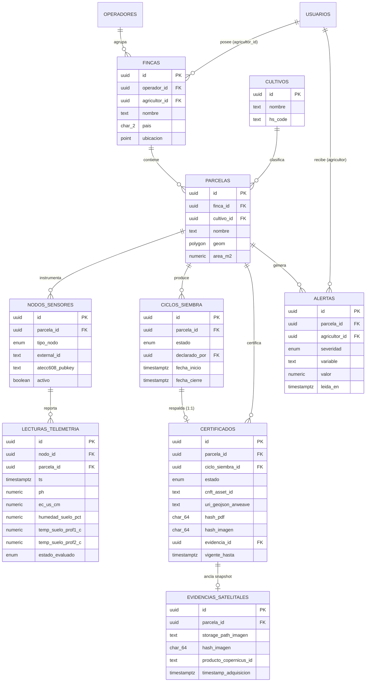
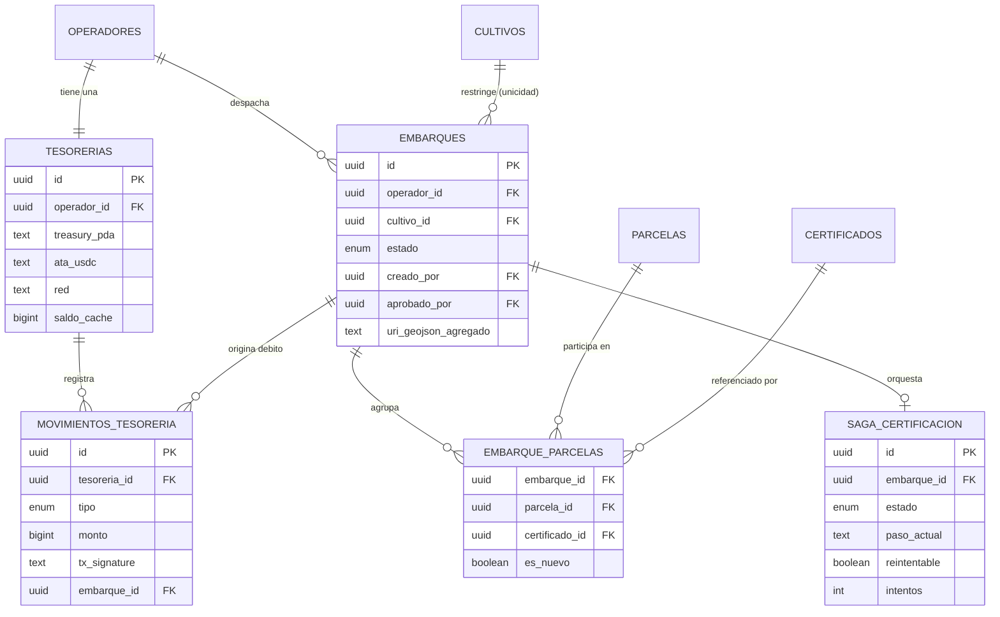

# GroundTruth — Modelo de Datos (v1)

> Diseño de tablas para Supabase (PostgreSQL + PostGIS), derivado directamente de `contexto-ground2.md` (arquitectura), `GroundTruth-Casos-de-Uso-por-Rol.md` y `GroundTruth-Indice-de-Vistas-y-Navegacion.md`. Cada tabla existe porque un caso de uso o una decisión (D1–D10) la exige — no hay tablas especulativas.

---

## 0. Estándares y convenciones

Se aplican a **todas** las tablas salvo que se indique lo contrario.

| Aspecto | Estándar | Nota |
| --- | --- | --- |
| Nombres de tabla/columna | `snake_case`, tablas en plural | Convención PostgreSQL/Supabase |
| Clave primaria | `id UUID PRIMARY KEY DEFAULT gen_random_uuid()` | Implícita en toda tabla; no se repite en cada listado |
| Marca de tiempo de creación | `created_at TIMESTAMPTZ NOT NULL DEFAULT now()` | Implícita en toda tabla; ISO 8601 vía tipo nativo de Postgres |
| Marca de actualización | `updated_at TIMESTAMPTZ NOT NULL DEFAULT now()` | Con trigger `BEFORE UPDATE`; solo en tablas mutables (se indica por tabla) |
| Coordenadas geográficas | PostGIS `geometry(Polygon, 4326)` / `geometry(Point, 4326)` | **SRID 4326 (WGS84)** — el mismo sistema que usa GeoJSON y el que exige la geolocalización EUDR |
| País | `CHAR(2)`, ISO 3166-1 alpha-2 | Ej. `CO` |
| Idioma | `CHAR(2)`, ISO 639-1 | Coincide con el roadmap i18n: `es, en, de, nl, it, fr, pt` |
| Cultivo / aduana | `hs_code TEXT` en `cultivos` | Código del Sistema Armonizado (customs), interoperable con TRACES NT |
| Hash | `CHAR(64)`, hex minúsculas | SHA-256; `CHECK (valor ~ '^[a-f0-9]{64}$')` |
| Dirección Solana (pubkey) | `TEXT` | Base58, 32–44 caracteres; `CHECK (length(valor) BETWEEN 32 AND 44)` |
| Montos USDC | `BIGINT` en unidades base (micro-USDC, 6 decimales) | Igual que el tipo `u64` on-chain — nunca `FLOAT`, evita error de redondeo |
| Estados de ciclo de vida fijos | Tipos `ENUM` nativos de Postgres | Ver §5 |
| Multi-tenancy | Toda tabla de dominio de negocio lleva (directa o indirectamente) `operador_id` | Es la columna sobre la que corren las políticas RLS (F7) |
| Borrado | No hay borrado físico de entidades de negocio | Se usan columnas de estado (`activo`, `revocado_en`, etc.) + `auditoria` |

**Motor:** PostgreSQL 15+ vía Supabase, extensión `pgcrypto` (para `gen_random_uuid()`) y `postgis` habilitadas.

---

## 1. Diagrama ER — Identidad y acceso (RBAC dinámico)

Corresponde al modelo de sub-roles a demanda: catálogo de privilegios fijo (lo define la plataforma) + sub-roles dinámicos (los crea cada unidad) + membresía `usuario × unidad × sub-rol`.

```mermaid
erDiagram
    OPERADORES ||--o{ MEMBRESIAS : "tiene miembros"
    OPERADORES ||--o{ SUB_ROLES : "define"
    OPERADORES ||--o{ FINCAS : "agrupa"
    USUARIOS ||--o{ MEMBRESIAS : "participa en"
    USUARIOS ||--o{ FINCAS : "es dueno de (agricultor_id)"
    SUB_ROLES ||--o{ MEMBRESIAS : "asignado en"
    SUB_ROLES ||--o{ SUB_ROL_PRIVILEGIOS : "otorga"
    CATALOGO_PRIVILEGIOS ||--o{ SUB_ROL_PRIVILEGIOS : "referenciado por"

    OPERADORES {
        uuid id PK
        text nombre
        char_2 pais
        enum estado
    }
    USUARIOS {
        uuid id PK
        uuid auth_user_id FK
        text email
        boolean es_admin
        boolean activo
    }
    SUB_ROLES {
        uuid id PK
        uuid operador_id FK
        text nombre
        boolean es_autogenerado
    }
    CATALOGO_PRIVILEGIOS {
        uuid id PK
        text clave
        boolean sensible
    }
    SUB_ROL_PRIVILEGIOS {
        uuid sub_rol_id FK
        uuid privilegio_id FK
    }
    MEMBRESIAS {
        uuid id PK
        uuid usuario_id FK
        uuid operador_id FK
        uuid sub_rol_id FK
        boolean activo
    }
```



**Decisión de diseño clave — "rol ≠ persona" (resuelve el caso del agricultor-exportador):** no existe una columna `rol` en `usuarios`. Los roles se **derivan**, no se almacenan:
- Es **Admin** si `usuarios.es_admin = true` (bandera global de plataforma).
- Es **Operador de una unidad** si tiene una fila en `membresias` para esa unidad (sus privilegios son los del `sub_rol` asignado).
- Es **Agricultor** si posee al menos una fila en `fincas.agricultor_id`.

Un mismo usuario puede cumplir varias condiciones a la vez (agricultor con vastas extensiones que también opera su propia unidad), sin ninguna tabla adicional — es la misma persona con distintas filas relacionadas.

### 1.1 Tablas de este dominio

**`operadores`** (unidad de negocio)

| Columna | Tipo | Notas |
| --- | --- | --- |
| `nombre` | `TEXT NOT NULL` | Cooperativa, gremio, exportador |
| `nit_o_id_fiscal` | `TEXT` | Nullable |
| `pais` | `CHAR(2)` | ISO 3166-1 |
| `estado` | `ENUM operador_estado` | `PENDIENTE_ONCHAIN, ACTIVO, SUSPENDIDO` — alta crea Treasury on-chain antes de activar |
| `updated_at` | `TIMESTAMPTZ` | Sí |

**`usuarios`**

| Columna | Tipo | Notas |
| --- | --- | --- |
| `auth_user_id` | `UUID UNIQUE NOT NULL` | FK lógica a `auth.users` de Supabase Auth |
| `nombre` | `TEXT NOT NULL` | |
| `email` | `TEXT UNIQUE NOT NULL` | |
| `idioma` | `CHAR(2) DEFAULT 'es'` | ISO 639-1; default = regla i18n |
| `es_admin` | `BOOLEAN NOT NULL DEFAULT false` | Bandera global de plataforma |
| `activo` | `BOOLEAN NOT NULL DEFAULT true` | |
| `desactivado_en` | `TIMESTAMPTZ` | Nullable |

**`sub_roles`**

| Columna | Tipo | Notas |
| --- | --- | --- |
| `operador_id` | `UUID NOT NULL FK → operadores` | Cada unidad crea los suyos |
| `nombre` | `TEXT NOT NULL` | Libre, definido por la unidad |
| `es_autogenerado` | `BOOLEAN NOT NULL DEFAULT false` | `true` solo para el sub-rol sembrado al crear la unidad |
| Restricción | `UNIQUE (operador_id, nombre)` | |

**`catalogo_privilegios`** (fijo, lo versiona la plataforma)

| Columna | Tipo | Notas |
| --- | --- | --- |
| `clave` | `TEXT UNIQUE NOT NULL` | Ej. `certificados.emitir` |
| `nombre` | `TEXT NOT NULL` | Etiqueta legible |
| `descripcion` | `TEXT` | |
| `sensible` | `BOOLEAN NOT NULL DEFAULT false` | `true` para `certificados.emitir` / `certificados.revocar` — exige confirmación al asignar |
| `deprecado_en` | `TIMESTAMPTZ` | Nullable |

**`sub_rol_privilegios`** (tabla puente)

| Columna | Tipo | Notas |
| --- | --- | --- |
| `sub_rol_id` | `UUID NOT NULL FK → sub_roles` | |
| `privilegio_id` | `UUID NOT NULL FK → catalogo_privilegios` | |
| Restricción | PK compuesta `(sub_rol_id, privilegio_id)` | |

**`membresias`**

| Columna | Tipo | Notas |
| --- | --- | --- |
| `usuario_id` | `UUID NOT NULL FK → usuarios` | |
| `operador_id` | `UUID NOT NULL FK → operadores` | |
| `sub_rol_id` | `UUID NOT NULL FK → sub_roles` | Debe pertenecer al mismo `operador_id` |
| `activo` | `BOOLEAN NOT NULL DEFAULT true` | |
| `invitado_en` | `TIMESTAMPTZ NOT NULL DEFAULT now()` | |
| `aceptado_en` | `TIMESTAMPTZ` | Nullable |
| Restricción | `UNIQUE (usuario_id, operador_id)` | Un usuario, un sub-rol activo por unidad |

**Guardarraíl "nunca sin timón":** *trigger* `BEFORE UPDATE OR DELETE` sobre `membresias` que bloquea desactivar la última membresía activa con `sub_rol` que incluya `equipo.gestionar` dentro de un mismo `operador_id`. No es expresable como `CHECK` simple porque depende de agregación entre filas.

---

## 2. Diagrama ER — Dominio agro y certificación

Corresponde a la jerarquía `Operador → Finca → Parcela → Ciclo de siembra → Certificado`, la telemetría IoT y la evidencia satelital (D1, D4, D7).



### 2.1 Tablas de este dominio

**`cultivos`** (lookup — café, cacao, aguacate; extensible)

| Columna | Tipo | Notas |
| --- | --- | --- |
| `nombre` | `TEXT UNIQUE NOT NULL` | |
| `hs_code` | `TEXT` | Código del Sistema Armonizado (ej. café verde = `0901.11`), interoperable con TRACES NT |

**`fincas`**

| Columna | Tipo | Notas |
| --- | --- | --- |
| `operador_id` | `UUID NOT NULL FK → operadores` | Unidad de negocio a la que pertenece |
| `agricultor_id` | `UUID NOT NULL FK → usuarios` | El dueño; esta fila es lo que hace a un usuario "agricultor" |
| `nombre` | `TEXT NOT NULL` | |
| `pais` | `CHAR(2)` | ISO 3166-1 |
| `ubicacion` | `geometry(Point, 4326)` | Nullable — punto de referencia, no el polígono |

**`parcelas`**

| Columna | Tipo | Notas |
| --- | --- | --- |
| `finca_id` | `UUID NOT NULL FK → fincas` | |
| `cultivo_id` | `UUID NOT NULL FK → cultivos` | Mono-cultivo por parcela |
| `nombre` | `TEXT NOT NULL` | Ej. "La Esperanza · lote 03" |
| `geom` | `geometry(Polygon, 4326) NOT NULL` | Polígono Leaflet / GPS de campo |
| `area_m2` | `NUMERIC GENERATED ALWAYS AS (ST_Area(geom::geography)) STORED` | Calculada por PostGIS, base de la regla de cobertura de sensores |
| `updated_at` | `TIMESTAMPTZ` | Sí |
| Índice | `USING GIST (geom)` | Obligatorio para consultas espaciales |

**`nodos_sensores`**

| Columna | Tipo | Notas |
| --- | --- | --- |
| `parcela_id` | `UUID NOT NULL FK → parcelas` | |
| `tipo_nodo` | `ENUM tipo_nodo` | `SIMULADO, FISICO` |
| `external_id` | `TEXT` | ID del dispositivo o del nodo simulado |
| `chirpstack_dev_eui` | `TEXT` | Nullable — nodos LoRaWAN reales |
| `atecc608_pubkey` | `TEXT` | Nullable — verifica firma de cada lectura |
| `activo` | `BOOLEAN NOT NULL DEFAULT true` | |
| `instalado_en` | `TIMESTAMPTZ` | |

**`lecturas_telemetria`** (alto volumen — ver §6)

| Columna | Tipo | Notas |
| --- | --- | --- |
| `nodo_id` | `UUID NOT NULL FK → nodos_sensores` | |
| `parcela_id` | `UUID NOT NULL FK → parcelas` | Denormalizado a propósito: evita join en cada consulta del dashboard |
| `ts` | `TIMESTAMPTZ NOT NULL` | Momento de la lectura |
| `ph` | `NUMERIC(4,2)` | |
| `ec_us_cm` | `NUMERIC(8,2)` | Conductividad, microsiemens/cm |
| `humedad_suelo_pct` | `NUMERIC(5,2)` | |
| `temp_suelo_prof1_c` | `NUMERIC(5,2)` | |
| `temp_suelo_prof2_c` | `NUMERIC(5,2)` | Insumo para inercia térmica |
| `firma_hex` | `TEXT` | Firma ATECC608 (cadena de custodia) |
| `estado_evaluado` | `ENUM estado_verificacion` | `VERDE, ROJO` |

**Nota — inercia térmica:** no es una columna. Se calcula bajo demanda (función SQL/vista materializada) sobre la serie de temperatura a 2 profundidades. Coherente con D7.

**`ciclos_siembra`**

| Columna | Tipo | Notas |
| --- | --- | --- |
| `parcela_id` | `UUID NOT NULL FK → parcelas` | |
| `estado` | `ENUM ciclo_estado` | `ACTIVO, CERRADO` |
| `declarado_por` | `UUID NOT NULL FK → usuarios` | Debe ser el `agricultor_id` de esa finca |
| `fecha_inicio` | `TIMESTAMPTZ NOT NULL` | |
| `fecha_cierre` | `TIMESTAMPTZ` | Nullable |
| `motivo_cierre` | `TEXT` | Nullable |

**`certificados`** — identidad = `(parcela_id, ciclo_siembra_id)`

| Columna | Tipo | Notas |
| --- | --- | --- |
| `numero_publico` | `TEXT UNIQUE` | Formato `GT-AAAA-NNNNN` (ej. `GT-2026-00342`); lo genera el backend al emitir (secuencia por año). Es la clave de búsqueda del verificador público y va impreso en PDF y QR. Nullable mientras `DRAFT` |
| `parcela_id` | `UUID NOT NULL FK → parcelas` | |
| `ciclo_siembra_id` | `UUID NOT NULL FK → ciclos_siembra` | |
| `estado` | `ENUM certificado_estado` | `DRAFT, ACTIVE, SUPERSEDED, EXPIRED, REVOKED` |
| `cnft_asset_id` | `TEXT` | Nullable hasta mintear |
| `uri_geojson_arweave` | `TEXT` | |
| `hash_pdf` | `CHAR(64)` | |
| `hash_imagen` | `CHAR(64)` | |
| `evidencia_id` | `UUID FK → evidencias_satelitales` | Snapshot congelado |
| `atestacion_switchboard` | `JSONB` | Nullable — reservado Fase B |
| `emitido_en` | `TIMESTAMPTZ` | Nullable |
| `vigente_hasta` | `TIMESTAMPTZ` | |
| `revocado_en` | `TIMESTAMPTZ` | Nullable |
| `revocado_motivo` | `TEXT` | Nullable |
| `revocado_por` | `UUID FK → usuarios` | Nullable |
| `superseded_by` | `UUID FK → certificados` | Autorreferencia |
| Restricción | `UNIQUE (parcela_id, ciclo_siembra_id)` | Llave de idempotencia |

**`evidencias_satelitales`**

| Columna | Tipo | Notas |
| --- | --- | --- |
| `parcela_id` | `UUID NOT NULL FK → parcelas` | |
| `storage_path_imagen` | `TEXT NOT NULL` | |
| `hash_imagen` | `CHAR(64) NOT NULL` | |
| `storage_path_pdf` | `TEXT` | Nullable |
| `hash_pdf` | `CHAR(64)` | Nullable |
| `producto_copernicus_id` | `TEXT` | |
| `timestamp_adquisicion` | `TIMESTAMPTZ` | |
| `evalscript_version` | `TEXT` | |
| `bbox` | `geometry(Polygon, 4326)` | |
| `crs` | `TEXT DEFAULT 'EPSG:4326'` | |
| `resolucion_m` | `NUMERIC` | |
| `formato` | `TEXT CHECK (formato IN ('PNG','GeoTIFF'))` | |

**`alertas`**

| Columna | Tipo | Notas |
| --- | --- | --- |
| `parcela_id` | `UUID NOT NULL FK → parcelas` | |
| `agricultor_id` | `UUID NOT NULL FK → usuarios` | |
| `tipo` | `TEXT CHECK (tipo IN ('IOT','SATELITAL'))` | Solo `IOT` activo en MVP |
| `severidad` | `ENUM alerta_severidad` | `INFO, ALERTA` |
| `variable` | `TEXT` | |
| `valor` | `NUMERIC` | |
| `umbral_referencia` | `NUMERIC` | |
| `mensaje` | `TEXT` | Clave i18n |
| `leida_en` | `TIMESTAMPTZ` | Nullable |

---

## 3. Diagrama ER — Tesorería, embarques y saga de certificación

Corresponde al cobro Pay-per-Proof (D1, D8), el manifiesto de embarque y el patrón saga que mitiga F4.



### 3.1 Tablas de este dominio

**`tesorerias`** (una por operador — D8)

| Columna | Tipo | Notas |
| --- | --- | --- |
| `operador_id` | `UUID UNIQUE NOT NULL FK → operadores` | 1:1 |
| `treasury_pda` | `TEXT UNIQUE NOT NULL` | Dirección derivada `["treasury", operador_id]` |
| `ata_usdc` | `TEXT UNIQUE NOT NULL` | Associated Token Account de USDC |
| `red` | `TEXT CHECK (red IN ('devnet','mainnet'))` | |
| `saldo_cache` | `BIGINT NOT NULL DEFAULT 0` | **Espejo, no fuente de verdad** — la fuente es la cuenta on-chain; se actualiza vía webhook Helius y tras cada débito |
| `actualizado_en` | `TIMESTAMPTZ` | |

**`movimientos_tesoreria`**

| Columna | Tipo | Notas |
| --- | --- | --- |
| `tesoreria_id` | `UUID NOT NULL FK → tesorerias` | |
| `tipo` | `ENUM movimiento_tipo` | `DEPOSITO, DEBITO_CERTIFICACION, DEBITO_MANIFIESTO` |
| `monto` | `BIGINT NOT NULL` | Unidades base (micro-USDC) |
| `tx_signature` | `TEXT UNIQUE NOT NULL` | Firma de transacción Solana — evita doble registro |
| `origen` | `TEXT` | Nullable — wallet de origen en depósitos |
| `embarque_id` | `UUID FK → embarques` | Nullable — solo en débitos |
| `helius_webhook_id` | `TEXT UNIQUE` | Nullable — idempotencia de la ingesta del webhook |
| `confirmado_en` | `TIMESTAMPTZ` | |

**`embarques`** (manifiesto — D1: sin cNFT propio)

| Columna | Tipo | Notas |
| --- | --- | --- |
| `operador_id` | `UUID NOT NULL FK → operadores` | Un embarque nunca cruza operadores |
| `cultivo_id` | `UUID NOT NULL FK → cultivos` | Regla de unicidad de cultivo |
| `estado` | `ENUM embarque_estado` | `BORRADOR, LISTO_APROBACION, PROCESANDO, EMITIDO, FALLIDO` |
| `creado_por` | `UUID NOT NULL FK → usuarios` | Requiere `embarques.preparar` |
| `aprobado_por` | `UUID FK → usuarios` | Nullable — requiere `certificados.emitir`; separación preparador/aprobador |
| `uri_geojson_agregado` | `TEXT` | Nullable — GeoJSON del manifiesto en Arweave |
| `storage_path_pdf_agregado` | `TEXT` | Nullable — Supabase Storage |
| `tarifa_manifiesto_cobrada` | `BIGINT` | Nullable |
| `tx_manifest_signature` | `TEXT` | Nullable — firma de la TX `emit_manifest` |
| `emitido_en` | `TIMESTAMPTZ` | Nullable |

**`embarque_parcelas`** (tabla puente N:N)

| Columna | Tipo | Notas |
| --- | --- | --- |
| `embarque_id` | `UUID NOT NULL FK → embarques` | |
| `parcela_id` | `UUID NOT NULL FK → parcelas` | |
| `certificado_id` | `UUID NOT NULL FK → certificados` | El reutilizado o el recién emitido |
| `es_nuevo` | `BOOLEAN NOT NULL` | `true` si se minteó en este despacho (para calcular `N` del cobro) |
| `tarifa_certificacion_cobrada` | `BIGINT` | Nullable — solo si `es_nuevo = true` |
| Restricción | `UNIQUE (embarque_id, parcela_id)` | |

**`saga_certificacion`** (mitigación F4)

| Columna | Tipo | Notas |
| --- | --- | --- |
| `embarque_id` | `UUID NOT NULL FK → embarques` | |
| `estado` | `ENUM saga_estado` | `CERT_PENDING, EVIDENCE_READY, ONCHAIN_CONFIRMED, FAILED` |
| `paso_actual` | `TEXT` | Ej. `descarga_satelital`, `subida_arweave`, `tx_solana` |
| `error_detalle` | `TEXT` | Nullable |
| `reintentable` | `BOOLEAN NOT NULL DEFAULT true` | |
| `intentos` | `INT NOT NULL DEFAULT 0` | |
| `certificate_id_idempotencia` | `TEXT UNIQUE` | Clave de idempotencia generada por el cliente |
| `actualizado_en` | `TIMESTAMPTZ` | |

---

## 4. Parámetros del sistema y auditoría

Tablas transversales — soportan las decisiones "configurable y provisional" (Q5, Q7) y el requisito de auditoría que aparece repetido en los casos de uso de Admin y Operador.

**`parametros_globales`** (tarifas y defaults — Admin A4)

| Columna | Tipo | Notas |
| --- | --- | --- |
| `clave` | `TEXT UNIQUE NOT NULL` | `tarifa_certificacion_usdc`, `tarifa_manifiesto_usdc`, `densidad_sensores_m2_default` |
| `valor` | `NUMERIC NOT NULL` | |
| `descripcion` | `TEXT` | |
| `actualizado_por` | `UUID FK → usuarios` | |
| `actualizado_en` | `TIMESTAMPTZ` | |

**`parametros_cultivo`** (override por cultivo — vigencia y sensores varían por café/cacao/aguacate)

| Columna | Tipo | Notas |
| --- | --- | --- |
| `cultivo_id` | `UUID NOT NULL FK → cultivos` | |
| `clave` | `TEXT NOT NULL` | `vigencia_max_dias`, `densidad_sensores_m2` |
| `valor` | `NUMERIC NOT NULL` | |
| Restricción | `UNIQUE (cultivo_id, clave)` | |

**`umbrales_eudr`** (verde/rojo por variable y cultivo — Q7, provisional)

| Columna | Tipo | Notas |
| --- | --- | --- |
| `cultivo_id` | `UUID NOT NULL FK → cultivos` | |
| `variable` | `TEXT CHECK (variable IN ('ph','ec_us_cm','humedad_suelo_pct','temp_suelo_c'))` | |
| `valor_min` | `NUMERIC NOT NULL` | |
| `valor_max` | `NUMERIC NOT NULL` | |
| Restricción | `UNIQUE (cultivo_id, variable)` | |

**`auditoria`** (genérica — cubre todo "queda auditado" de los casos de uso)

| Columna | Tipo | Notas |
| --- | --- | --- |
| `actor_id` | `UUID FK → usuarios` | Nullable si la acción es del sistema |
| `operador_id` | `UUID FK → operadores` | Nullable — alcance de la acción |
| `accion` | `TEXT NOT NULL` | Ej. `sub_rol.crear`, `parametro.actualizar`, `certificado.revocar`, `membresia.desactivar` |
| `entidad` | `TEXT NOT NULL` | Nombre de la tabla afectada |
| `entidad_id` | `UUID` | Nullable |
| `valor_anterior` | `JSONB` | Nullable |
| `valor_nuevo` | `JSONB` | Nullable |

**Por qué una tabla genérica y no una por evento:** los puntos de auditoría están dispersos por todo el sistema (equipo, parámetros, revocaciones, reasignaciones) y todos comparten la misma forma (quién, qué, antes/después). Una tabla `auditoria` con `JSONB` evita crear y mantener una tabla de log distinta por cada tipo de cambio.

---

## 5. Tipos ENUM nativos

Solo para máquinas de estado fijas y estables (bajo cardinalidad, definidas por el negocio, no por el usuario). Todo lo que una unidad de negocio pueda extender (privilegios, cultivos, sub-roles) es tabla, no `ENUM`.

```sql
CREATE TYPE operador_estado        AS ENUM ('PENDIENTE_ONCHAIN','ACTIVO','SUSPENDIDO');
CREATE TYPE tipo_nodo              AS ENUM ('SIMULADO','FISICO');
CREATE TYPE estado_verificacion    AS ENUM ('VERDE','ROJO');
CREATE TYPE ciclo_estado           AS ENUM ('ACTIVO','CERRADO');
CREATE TYPE certificado_estado     AS ENUM ('DRAFT','ACTIVE','SUPERSEDED','EXPIRED','REVOKED');
CREATE TYPE alerta_severidad       AS ENUM ('INFO','ALERTA');
CREATE TYPE movimiento_tipo        AS ENUM ('DEPOSITO','DEBITO_CERTIFICACION','DEBITO_MANIFIESTO');
CREATE TYPE embarque_estado        AS ENUM ('BORRADOR','LISTO_APROBACION','PROCESANDO','EMITIDO','FALLIDO');
CREATE TYPE saga_estado            AS ENUM ('CERT_PENDING','EVIDENCE_READY','ONCHAIN_CONFIRMED','FAILED');
```

`certificado_estado` implementa exactamente la máquina de estados definida en la arquitectura (`DRAFT → ACTIVE → {SUPERSEDED | EXPIRED | REVOKED}`).

---

## 6. Índices y particionamiento

| Tabla | Índice | Razón |
| --- | --- | --- |
| `parcelas` | `GIST (geom)` | Consultas espaciales (mapa, cálculo de área) |
| `fincas` | `GIST (ubicacion)` | Idem, si se consulta por proximidad |
| `lecturas_telemetria` | `BRIN (ts)` | Tabla append-only de alto volumen; BRIN es mucho más liviano que B-tree para series de tiempo |
| `lecturas_telemetria` | `BTREE (parcela_id, ts DESC)` | Patrón de consulta dominante: "última lectura de esta parcela" |
| `lecturas_telemetria` | Particionado por rango mensual de `ts` | Ver nota abajo |
| `certificados` | `UNIQUE BTREE (parcela_id, ciclo_siembra_id)` | Ya cubre idempotencia; sirve también como índice de búsqueda |
| `movimientos_tesoreria` | `UNIQUE (tx_signature)`, `UNIQUE (helius_webhook_id)` | Idempotencia de ingesta on-chain y de webhook |
| `alertas` | `BTREE (agricultor_id, leida_en)` | Bandeja de alertas de la DApp lite, filtrando no leídas |
| `auditoria` | `BTREE (operador_id, created_at DESC)` | Vista de auditoría por unidad |

**Particionamiento de `lecturas_telemetria`:** con simulador corriendo continuamente (y más aún con hardware real vía ChirpStack), esta tabla crece sin límite. Se recomienda **particionamiento nativo de PostgreSQL por rango mensual** (`PARTITION BY RANGE (ts)`), con una política de retención que archive o comprima particiones de meses anteriores. No es necesario para el MVP con pocos nodos simulados, pero conviene crear la tabla ya particionada desde el inicio — convertir una tabla existente en particionada después es una migración cara.

---

## 7. Multi-tenancy y Row Level Security (F7)

Toda tabla de dominio de negocio resuelve su unidad de negocio, directa o transitivamente, así:

```
operadores.id
  ← fincas.operador_id
  ← parcelas (vía fincas.finca_id)
  ← certificados, evidencias_satelitales, alertas (vía parcelas)
  ← embarques.operador_id
  ← tesorerias.operador_id, movimientos_tesoreria (vía tesorerias)
  ← membresias.operador_id, sub_roles.operador_id
```

**Patrón de política RLS (ejemplo sobre `parcelas`):**

```sql
CREATE POLICY parcelas_por_unidad ON parcelas
  USING (
    finca_id IN (
      SELECT f.id FROM fincas f
      JOIN membresias m ON m.operador_id = f.operador_id
      JOIN usuarios u ON u.id = m.usuario_id
      WHERE u.auth_user_id = auth.uid() AND m.activo
    )
    OR EXISTS (SELECT 1 FROM usuarios WHERE auth_user_id = auth.uid() AND es_admin)
  );
```

El mismo patrón (join hasta `membresias` o bandera `es_admin`) se repite para cada tabla del dominio agro/certificación/tesorería. Para `FARMER`, la política equivalente filtra por `fincas.agricultor_id = usuario_actual`, acotado además a las columnas que la DApp lite expone (Q6): lectura de alertas y de sus propias parcelas, escritura solo en `ciclos_siembra` (declarar nueva siembra).

Los **privilegios de Operador** (`certificados.emitir`, `equipo.gestionar`, etc.) no se resuelven en RLS de PostgreSQL directamente — RLS resuelve *a qué fila* se puede acceder (aislamiento por unidad); *qué acción* dentro de esa unidad se permite es responsabilidad del backend NestJS, que calcula los privilegios efectivos del `sub_rol` en cada request. Mezclar ambos niveles en RLS sería frágil (el catálogo de privilegios cambia con cada feature nueva); la separación aísla por tenant en la base de datos y autoriza por acción en el backend.

### 7.1 Acceso anónimo — verificador público (V2)

El verificador es la única superficie sin autenticación, y **no** se resuelve dando acceso anónimo a `certificados` (expondría el tenant completo). Se resuelve con una **vista restringida** que materializa exactamente el contrato de privacidad definido en los casos de uso (muestra estado/cultivo/región/hashes; nunca nombre del agricultor ni polígono preciso):

```sql
CREATE VIEW certificados_publicos AS
SELECT c.numero_publico, c.estado, c.cnft_asset_id,
       c.uri_geojson_arweave, c.hash_pdf, c.hash_imagen,
       c.emitido_en, c.vigente_hasta, c.revocado_en,
       cu.nombre AS cultivo, f.pais
FROM certificados c
JOIN parcelas p  ON p.id = c.parcela_id
JOIN fincas f    ON f.id = p.finca_id
JOIN cultivos cu ON cu.id = p.cultivo_id
WHERE c.estado <> 'DRAFT';
```

El rol `anon` de Supabase recibe `SELECT` **solo** sobre esta vista (ninguna tabla base), y la API pública consulta por `numero_publico` o `cnft_asset_id` con rate-limiting en NestJS. Así el contrato de privacidad vive en el esquema — no depende de que cada endpoint recuerde qué columnas ocultar.

---

## 8. Mapeo off-chain ↔ on-chain

Referencia rápida de qué campo de la base de datos es el **espejo de lectura** de qué cuenta on-chain, y quién es la fuente de verdad.

| Dato | Fuente de verdad | Espejo off-chain |
| --- | --- | --- |
| Saldo de tesorería | Cuenta ATA en Solana | `tesorerias.saldo_cache` (actualizado por webhook, nunca se le resta directamente sin confirmar la TX) |
| Estado `ACTIVE`/`REVOKED` del certificado | **Off-chain** (`certificados.estado`) | El cNFT es inmutable; el estado de vigencia vive en Postgres por diseño (D1) |
| Existencia del certificado (idempotencia) | Ambos: `CertificateRecord` PDA on-chain + `certificados` (parcela_id, ciclo_siembra_id) off-chain | Deben coincidir; el backend valida contra la cadena antes de confiar en la caché |
| Hash de imagen/PDF | Off-chain calcula, on-chain ancla | `certificados.hash_pdf` / `hash_imagen` = mismo valor que va en los metadatos del cNFT |
| URI del GeoJSON | Arweave (permanente) | `certificados.uri_geojson_arweave` es una copia de lectura del URI ya anclado |

---

## 9. Notas de extensión futura

Coherente con la sección "Fuera de alcance del MVP" del documento de casos de uso — estas tablas **no se crean ahora**, pero el esquema actual no las bloquea:

- **Micropago al agricultor (Fase 2):** requerirá `fincas.wallet_pda` (columna nueva, nullable hoy) y una tabla `micropagos` referenciando `embarque_parcelas`.
- **Data Marketplace / DeSci:** consumiría `lecturas_telemetria` y `certificados` vía una capa de exportación; no requiere tablas nuevas en el MVP, solo permisos de lectura adicionales.
- **Monitoreo satelital en tiempo real:** el campo `alertas.tipo` ya admite `'SATELITAL'` en su `CHECK`, aunque no se emita todavía.
- **Lote comercial multi-parcela:** hoy `parcelas` = lote (1:1); una tabla puente `lotes_parcelas` cubriría el mapeo N:1 sin tocar el resto del esquema.
